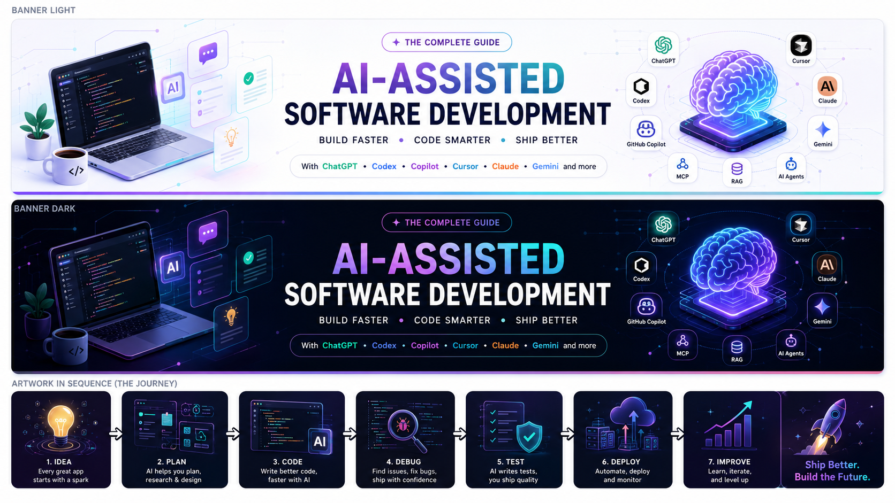

<div align="center">
<picture>
  <source media="(prefers-color-scheme: dark)" srcset="images/banner-dark.png">
  <source media="(prefers-color-scheme: light)" srcset="images/banner-light.png">
  
</picture>

# AI Assisted Development Book — Volume 1

### *Introduction to AI-Assisted Software Development*

[](#-release-plan)
[](chapters/01-foundations/01-introduction.md)
[](https://ashwinkrpi.github.io/ai-assisted-development-book/)
[](LICENSE)

</div>

---

## 👋 Welcome

Software engineering is evolving rapidly, and AI is changing how we design, build, test, deploy, and maintain software.

This repository accompanies the **AI Assisted Development Book**, built around a simple principle:

> **AI is a force multiplier — not a replacement for engineering judgement.**

Each volume of this book is a complete, standalone chapter — publication-ready, with worked examples, tested code, and hands-on labs — released independently rather than as one large book. **Volume 1** covers **Chapter 1: Introduction to AI-Assisted Software Development**.

📖 **Read it online:** [ashwinkrpi.github.io/ai-assisted-development-book](https://ashwinkrpi.github.io/ai-assisted-development-book/)

---

## 📖 Release Plan

This book is being released one chapter at a time, as its own volume. Each volume is self-contained, so you don't need later volumes to get value from earlier ones — and you don't need to wait for the full book to start applying what's here.

| Volume | Status | Chapter |
|---|---|---|
| **Volume 1** | ✅ **Released (this repository)** | Chapter 1 — Introduction to AI-Assisted Software Development |
| Volume 2 | 🔜 Coming soon | Chapter 2 — Why AI Is Transforming Software Development |
| Volume 3 | 🔜 Coming soon | Chapter 3 — Understanding Large Language Models for Software Engineers |
| Volume 4 | 🔜 Coming soon | Chapter 4 — The AI-Assisted Software Development Lifecycle |
| Volume 5 | 🔜 Coming soon | Chapter 5 — Building Your AI-Assisted Development Environment |
| Volume 6 | 🔜 Coming soon | Chapter 6 — Your First AI-Assisted Software Project |

> 📌 The site currently shows all six chapters in its navigation for reference[^1], but only **Chapter 1 is the official Volume 1 release**. Chapters 2–6 are drafts and will be published as their own volumes.

---

## 📘 What's in Volume 1

**Chapter 1 — Introduction to AI-Assisted Software Development** covers:

- Why this book exists, and the four principles every technique in it is built on
- The evolution of software engineering, from machine code to generative AI
- What AI-assisted software development actually is — and isn't
- How human engineers and AI systems bring complementary strengths
- Where AI contributes across the software development lifecycle (SDLC)
- The genuine strengths and recurring limitations of current AI systems
- A full case study: implementing password reset the right way vs. the risky way
- The eight-step workflow used throughout the rest of the book
- A hands-on lab: building a command-line calculator using that workflow

📄 Read it here: [`chapters/01-foundations/01-introduction.md`](chapters/01-foundations/01-introduction.md)

---

## 🔮 Future Volumes

The topics below are already drafted and will each be released as their own volume. Titles and topics are final; scope may be refined before release.

### Volume 2 — Why AI Is Transforming Software Development
- A new kind of productivity revolution
- Why organizations are investing in AI
- Where AI adds real value — and where it doesn't
- Why AI does not eliminate the need for engineering
- Case study: modernizing a legacy application
- Principles for adopting AI on an engineering team

### Volume 3 — Understanding Large Language Models for Software Engineers
- Why software engineers should understand how LLMs work
- What a Large Language Model actually is
- Training, fine-tuning, and inference — and which one you interact with
- Tokens and context windows
- Why hallucinations happen
- Strengths of modern LLMs
- Practical guidelines for working with LLMs day to day

### Volume 4 — The AI-Assisted Software Development Lifecycle
- Beyond code generation: AI across the full SDLC
- The AI-assisted SDLC, phase by phase
- Human quality gates that should never be bypassed
- A practical, repeatable AI-assisted workflow

### Volume 5 — Building Your AI-Assisted Development Environment
- Why your development environment matters
- A reference architecture for an AI-assisted workstation
- Essential components and tooling
- Recommended project layout
- Security considerations for AI-assisted development
- Running a local AI stack on a Raspberry Pi 5
- Productivity practices that scale with a team

### Volume 6 — Your First AI-Assisted Software Project
- Planning a complete project: a command-line Notes Manager
- Designing a layered architecture (model, repository, service, CLI)
- Building it incrementally, one reviewable commit at a time
- Writing and running a real automated test suite
- Documenting the finished project
- A hands-on lab to extend the project further

---

## 📂 Repository Structure

```text
chapters/
├── index.md
└── 01-foundations/
    ├── 01-introduction.md
    ├── 02-why-ai-is-transforming-software-development.md
    ├── 03-understanding-large-language-models.md
    ├── 04-ai-assisted-software-development-lifecycle.md
    ├── 05-building-your-ai-assisted-development-environment.md
    └── 06-your-first-ai-assisted-software-project.md
images/
.github/
└── workflows/
    └── deploy-docs.yml
mkdocs.yml
LICENSE
CONTRIBUTING.md
README.md
```

> Note: only Chapter 1 is released as Volume 1. Chapters 2–6 are included in this repository as drafts for reference and future publication, and will be released independently as Volumes 2–6.

---

## 🌐 Building the Site Locally

This repository is published with [MkDocs](https://www.mkdocs.org) and the [Material theme](https://squidfunk.github.io/mkdocs-material/).

```bash
pip install mkdocs-material
mkdocs serve
```

Open `http://127.0.0.1:8000`. Pushes to `main` that touch `chapters/**` or `mkdocs.yml` automatically rebuild and redeploy the live site via `.github/workflows/deploy-docs.yml`.

---

## 🚀 Getting Started

1. Clone the repository.
2. Read [Chapter 1](chapters/01-foundations/01-introduction.md) — or browse the [live site](https://ashwinkrpi.github.io/ai-assisted-development-book/).
3. Complete the hands-on lab at the end of the chapter.
4. Apply the eight-step workflow to a small task in your own work.

---

## 🤝 Contributing

Contributions are welcome — please read **[CONTRIBUTING.md](CONTRIBUTING.md)** before opening an issue or pull request.

---

## ⭐ Support

If you found this volume useful:

- ⭐ Star the repository
- 🍴 Fork it
- 💬 Share it with your team
- 🚀 Watch for Volume 2

---

<div align="center">

**Build responsibly. Learn continuously. Ship confidently.**

</div>

---

[^1]: Chapters that are not part of the current Volume 1 release remain visible in this repository and on the site for reference only. They have not been removed — they will be published in full as Volumes 2 through 6.
