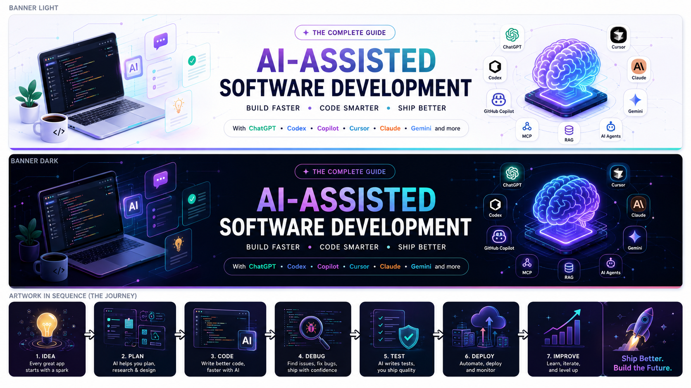

<div align="center">
<picture>
  <source media="(prefers-color-scheme: dark)" srcset="images/banner-dark.png">
  <source media="(prefers-color-scheme: light)" srcset="images/banner-light.png">
  
</picture>

# AI Assisted Development Book — Volume 1

### *Part 1: Foundations of AI-Assisted Software Development*

[](#-release-plan)
[](chapters/index.md)
[](https://ashwinkrpi.github.io/ai-assisted-development-book/)
[](LICENSE)

</div>

---

## 👋 Welcome

Software engineering is evolving rapidly, and AI is changing how we design, build, test, deploy, and maintain software.

This repository contains the **AI Assisted Development Book**, built around a simple principle:

> **AI is a force multiplier — not a replacement for engineering judgment.**

The book is released one **part** at a time, and each part is published as its own **volume**. **Volume 1** is **Part 1: Foundations**, which has six chapters, from what AI-assisted development is through building your first complete project.

📖 **Read it online:** [ashwinkrpi.github.io/ai-assisted-development-book](https://ashwinkrpi.github.io/ai-assisted-development-book/)

---

## 📖 Release Plan

| Volume | Part | Status |
|---|---|---|
| **Volume 1** | **Part 1 — Foundations** (Chapters 1–6) | ✅ Released, under revision |
| Volume 2 | Part 2 — Prompt Engineering and Communicating with AI | 🔜 Planned |
| Later volumes | Further parts | 🔜 Planned |

Each volume stands on its own. You don't need later volumes to get value from earlier ones.

---

## 📘 What's in Volume 1

| Chapter | Covers |
|---|---|
| [1 — Introduction to AI-Assisted Software Development](chapters/01-foundations/01-introduction.md) | What AI-assisted development is (and isn't), the four principles behind the book, a password-reset case study, and the eight-step workflow used throughout |
| [2 — Why AI Is Transforming Software Development](chapters/01-foundations/02-why-ai-is-transforming-software-development.md) | Why organizations adopt AI, where it adds value and where it doesn't, a legacy-modernization case study, and adoption principles |
| [3 — Understanding Large Language Models](chapters/01-foundations/03-understanding-large-language-models.md) | Tokens, context windows, training versus inference, why hallucinations happen, and practical guidelines |
| [4 — The AI-Assisted Software Development Lifecycle](chapters/01-foundations/04-ai-assisted-software-development-lifecycle.md) | AI in each phase of the SDLC, prompt patterns, and human quality gates enforced in CI |
| [5 — Building Your AI-Assisted Development Environment](chapters/01-foundations/05-building-your-ai-assisted-development-environment.md) | Editor and tooling setup, project layout, security, and a local AI stack on a Raspberry Pi 5 |
| [6 — Your First AI-Assisted Software Project](chapters/01-foundations/06-your-first-ai-assisted-software-project.md) | Building a command-line Notes Manager step by step, with tests and documentation |

Every chapter ends with a hands-on lab and review questions.

---

## 📂 Repository Structure

```text
chapters/                 # book source (published by MkDocs)
├── index.md
└── 01-foundations/
    ├── 01-introduction.md
    ├── 02-why-ai-is-transforming-software-development.md
    ├── 03-understanding-large-language-models.md
    ├── 04-ai-assisted-software-development-lifecycle.md
    ├── 05-building-your-ai-assisted-development-environment.md
    └── 06-your-first-ai-assisted-software-project.md
images/                   # README banner images
.github/workflows/
└── deploy-docs.yml       # builds and deploys the site
mkdocs.yml
CONTRIBUTING.md
LICENSE
README.md
```

---

## 🌐 Building the Site Locally

The site is built with [MkDocs](https://www.mkdocs.org) and the [Material theme](https://squidfunk.github.io/mkdocs-material/).

```bash
pip install mkdocs-material "mkdocs<2"
mkdocs serve
```

Then open `http://127.0.0.1:8000`. Pushes to `main` that change `chapters/**` or `mkdocs.yml` rebuild and redeploy the live site automatically through `.github/workflows/deploy-docs.yml`.

---

## 🚀 Getting Started

1. Read [Chapter 1](chapters/01-foundations/01-introduction.md), or browse the [live site](https://ashwinkrpi.github.io/ai-assisted-development-book/).
2. Do the hands-on lab at the end of each chapter.
3. Apply the eight-step workflow from Chapter 1 to a small task in your own work.

---

## 🤝 Contributing

Contributions are welcome. Please read **[CONTRIBUTING.md](CONTRIBUTING.md)** before opening an issue or pull request.

---

## ⭐ Support

If you found this volume useful:

- ⭐ Star the repository
- 🍴 Fork it
- 💬 Share it with your team
- 🚀 Watch for Volume 2

---

<div align="center">

**Build responsibly. Learn continuously. Ship confidently.**

</div>
