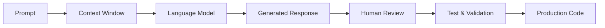

# Chapter 3 — Understanding Large Language Models for Software Engineers

> *You do not need to become an AI researcher to use AI effectively, but you do need to understand how modern language models generate text, where that mechanism breaks down, and what that means for the code you ship.*

## Learning Objectives

By the end of this chapter, you will be able to:

- Explain what a Large Language Model (LLM) is, in terms precise enough to be useful rather than just evocative.
- Distinguish between training, fine-tuning, inference, and tool use — and know which one you're actually interacting with day to day.
- Explain tokens and context windows well enough to reason about why a model "forgot" something earlier in a long session.
- Recognize why hallucinations happen, and predict the situations where they're most likely.
- Apply a concrete, repeatable set of practices for using LLMs safely in professional software engineering.

---

## 3.1 Why Software Engineers Should Understand This

Modern AI assistants appear to "understand" programming languages, system architecture, and human intent. They don't — not in the sense that a compiler understands syntax or a database understands a schema. An LLM is a statistical model of language, and everything it produces, including code, is generated one token at a time based on probability, not by executing logic or checking facts against a source of truth.

That distinction isn't philosophical — it has direct, practical consequences. It explains why a model can write a syntactically perfect function that calls a method which doesn't exist. It explains why the same question can get a slightly different answer twice. And it explains why the fix for many "the AI got this wrong" situations isn't a better model — it's better context, or a verification step you skipped. Understanding the mechanism turns AI from something you either trust blindly or distrust reflexively into a tool you can use with calibrated confidence.

---

## 3.2 What Is a Large Language Model?

A **Large Language Model (LLM)** is a neural network trained on very large collections of text and code. During training, it learns statistical relationships between **tokens** — the sub-word units (roughly, word fragments and code symbols) that models operate on instead of raw text.

At inference time, the model doesn't retrieve stored facts or execute logic. It predicts the single most probable next token, appends it, and repeats — generating a response one token at a time based on everything that came before it in the context window.

A concrete way to see this: tokenizers are usually available as libraries you can run yourself. Here's what tokenization actually looks like for a short piece of code, using OpenAI's open-source `tiktoken` library (a reasonable stand-in for how most modern LLMs tokenize, including Claude's family of models):

```bash
pip install tiktoken
```

```python
import tiktoken

encoding = tiktoken.get_encoding("cl100k_base")

code = "def add(a, b):\n    return a + b"
tokens = encoding.encode(code)

print(f"Text: {code!r}")
print(f"Token count: {len(tokens)}")
print(f"Token IDs: {tokens}")
for t in tokens:
    print(f"  {t:>6}  ->  {encoding.decode([t])!r}")
```

```text
Text: 'def add(a, b):\n    return a + b'
Token count: 11
Token IDs: [755, 909, 2948, 11, 293, 997, 262, 471, 264, 489, 293]
  755   ->  'def'
  909   ->  ' add'
  2948  ->  '(a'
  11    ->  ','
  293   ->  ' b'
  997   ->  '):\n'
  262   ->  '    '
  471   ->  'return'
  264   ->  ' a'
  489   ->  ' +'
  293   ->  ' b'
```

Notice that "words" and tokens don't line up one-to-one — `def add(a, b):` becomes several tokens, some of them partial words or punctuation clusters. This matters practically because context windows, API pricing, and "how much can I paste into one prompt" are all measured in tokens, not characters or words. A 3,000-line file is not automatically safe to paste into a single prompt just because it "looks" manageable — check the token count.

The model is not searching the internet or reading your repository unless a tool explicitly gives it that capability — file access, web search, or a connected code index. Absent that, everything it produces comes from patterns learned during training plus whatever you've put directly into the current context window.

---

## 3.3 Training, Fine-Tuning, and Inference

| Phase | Purpose | Who does this |
|---|---|---|
| Pre-training | Learn language and code patterns from massive datasets | The model provider (e.g., Anthropic, OpenAI) |
| Fine-tuning / RLHF | Shape behavior for helpfulness, safety, and specific tasks | The model provider |
| Inference | Generate a response to your prompt | You, every time you send a message |
| Tool use | Access external knowledge or take actions (search, run code, call APIs) | You, by enabling and invoking tools |

Most engineers only ever interact with the last two rows. That's worth internalizing because it reframes a lot of "prompting technique" advice: you are not teaching the model anything permanent when you have a conversation with it. Nothing you type during inference changes the underlying weights. Every new conversation starts from the same trained model, which is why context — what you explicitly provide in *this* session — carries so much weight.

---

## 3.4 Tokens and Context Windows

A **context window** is the total amount of text (measured in tokens) a model can consider at once when generating a response. It typically contains, all combined into one budget:

- System instructions (behavior rules set by the application)
- Your prompts
- Conversation history
- Retrieved documents or file contents
- Tool outputs (search results, command output, etc.)

When the total exceeds the model's context window, something has to give — usually the oldest parts of the conversation stop influencing the response, even though they're technically still "there" in the chat history you can scroll back to. This is a common source of a specific, recognizable failure: a long coding session where the model suddenly seems to forget a constraint you mentioned an hour ago. It didn't forget conceptually — that information simply fell outside the window that actually gets used to generate the next token.

You can observe this directly. If you're working with a local model via Ollama, you can inspect and set the context window explicitly:

```bash
ollama show hermes3 --modelfile
```

```text
FROM hermes3:8b
PARAMETER num_ctx 8192
PARAMETER stop "<|im_end|>"
TEMPLATE """{{ .System }}
<|im_start|>user
{{ .Prompt }}<|im_end|>
<|im_start|>assistant
"""
```

The `num_ctx` parameter here — 8,192 tokens by default for this model — is the entire budget shared across system prompt, conversation history, and generated response. On resource-constrained hardware like a Raspberry Pi 5, this is a real, practical constraint, not an abstract one: a smaller context window means shorter conversations, less pasted code, and more deliberate context management than you'd need with a cloud model offering a 100K+ token window. This is directly relevant to the local Hermes-based pipelines discussed later in this book — context budget is a design constraint you plan around, not an implementation detail you can ignore.

---

## 3.5 Why Hallucinations Happen

A **hallucination** is generated content that is fluent and plausible but factually wrong. In a coding context, this shows up as: invented API methods, incorrect command-line flags, references to libraries or functions that don't exist, misquoted documentation, or confidently stated but incorrect assumptions about business rules the model was never told.

Hallucinations aren't a bug that gets patched out — they're a structural consequence of how generation works. The model is always producing the *statistically likely* continuation of the text so far, not a verified fact. When the true answer is well-represented in training data and the prompt is specific, the likely continuation and the correct answer usually coincide. When the prompt is vague, the required information wasn't in training data, or you're asking about a fast-moving library that changed after the model's training cutoff, "plausible" and "correct" diverge — and the model has no internal signal telling it that's happening. It generates the wrong answer with exactly the same fluency as the right one.

Here's a realistic example — asking a model, without any real project context, for a specific method:

```
Prompt: "Show me how to use the retry decorator from the requests library."
```

The `requests` library doesn't ship a built-in retry decorator — retry logic is typically implemented via `urllib3.util.retry.Retry` combined with `requests.adapters.HTTPAdapter`, or through a separate package like `tenacity`. A model with weak grounding on this specific detail may nonetheless generate a confident, syntactically clean example calling `requests.retry(...)`, because that pattern name is *plausible* given how other libraries are structured — even though it doesn't exist. This is precisely the failure mode to watch for: fluency and correctness are independent properties of the output, and only one of them is guaranteed.

**Practical mitigation:** when you're not certain an API surface is real, verify it against actual documentation or the installed package before it goes anywhere near a commit — `pip show requests`, the official docs, or a quick `python -c "import requests; help(requests)"` are cheaper than debugging a hallucinated method three commits later.

---

## 3.6 Strengths of Modern LLMs

Modern models are genuinely strong at a specific, recognizable set of tasks:

- Explaining existing code, including large or unfamiliar codebases
- Summarizing documentation, tickets, and long discussion threads
- Translating logic between programming languages
- Generating repetitive, well-specified code (boilerplate, CRUD, data transformations)
- Producing a first draft of documentation from working code
- Brainstorming multiple implementation approaches quickly

These strengths are exactly why the framing in this book treats AI as a highly capable engineering assistant rather than an autonomous developer. Assistant work — drafting, explaining, summarizing, proposing — is where the fluency/correctness gap matters least, because a human is reviewing the output before it has consequences. Autonomous work — merging without review, deploying without testing — is where that same gap becomes expensive.

---

## 3.7 Practical Guidelines

A short, concrete checklist for working with an LLM on real engineering tasks:

1. **Provide sufficient context** — relevant files, constraints, and prior decisions, not just the immediate question.
2. **Define the desired outcome explicitly** — what "done" looks like, not just what you want it to attempt.
3. **Ask for assumptions** — have the model state what it's assuming before it generates code, so you can correct it early.
4. **Request incremental changes** — one function or component at a time, not an entire feature in one response.
5. **Verify every result** — read the generated code, don't just skim that it "looks right."
6. **Run automated tests** — against generated code exactly as you would against a new contributor's pull request.
7. **Review security implications explicitly** — input validation, auth checks, and unsafe defaults are common hallucination targets because they're easy to generate plausibly and easy to skip reviewing.

A useful habit: explicitly asking the model to state its assumptions catches a large share of misunderstandings before any code is written. For example:

```
Before writing the implementation, list any assumptions you're making about:
- Input validation requirements
- Expected data types and ranges
- Error handling behavior
- Any existing conventions in this codebase you're inferring

Then wait for me to confirm or correct them before generating code.
```

This single habit — asking for assumptions before generation, not after — prevents a large share of the rework this book keeps warning about.

---

## Engineering Insight

> The quality of an AI response is determined as much by the quality of the context you provide as by the raw capability of the model itself.

---

## Common Mistakes

- Assuming the model "knows" your project just because you're deep into a conversation about it.
- Accepting generated code without running it, let alone testing it.
- Asking for an entire application or feature in a single prompt, making review effectively impossible.
- Ignoring compiler warnings, linter output, or static analysis flags on generated code.
- Treating a confident tone as evidence of correctness — confidence and accuracy are generated independently.

---

## How a Response Actually Gets Produced



The first three boxes are entirely mechanical and probabilistic. The last three — review, testing, validation — are where engineering judgment lives, and they're not optional steps you can compress away, regardless of how good the model gets.

---

## Hands-On Lab: Tokens, Context, and Hallucination in Practice

This lab has three parts, each demonstrating a concept from this chapter directly rather than abstractly.

**Part 1 — See tokenization yourself.** Run the `tiktoken` script from Section 3.2 against a real file from one of your own projects instead of the toy example:

```python
import tiktoken

encoding = tiktoken.get_encoding("cl100k_base")

with open("your_file.py", "r") as f:
    code = f.read()

tokens = encoding.encode(code)
print(f"File: your_file.py")
print(f"Characters: {len(code)}")
print(f"Tokens: {len(tokens)}")
print(f"Ratio: {len(code) / len(tokens):.2f} chars/token")
```

Compare the character count to the token count. This ratio is what you're actually budgeting against when you paste large files into a prompt.

**Part 2 — Trigger a hallucination deliberately.** Pick a library you know well and ask an AI assistant to show you a method or flag that sounds plausible but doesn't exist (for example, a made-up flag on a CLI tool you use often). Note how confidently it's presented, then verify against the real documentation or `--help` output.

**Part 3 — Test the context window limit.** If you have Ollama running locally (as covered in Chapter 5), start a long conversation, mention a specific constraint early on (e.g., "always use snake_case for variable names"), then paste a large amount of unrelated code or text, and finally ask a question that depends on the earlier constraint. Note whether the model still applies it, and relate what you observe back to Section 3.4.

Record your findings for all three parts — this is the beginning of your own calibrated intuition for when to trust AI output and when to slow down and verify.

> **Screenshot placeholder:** Capture your terminal output from Part 1 (the token count comparison) and, if you complete Part 3, a screenshot of the point in the conversation where the model does or doesn't correctly apply the earlier constraint. Insert both here in the published version, with captions identifying what each one demonstrates.

---

## Chapter Summary

Large Language Models are probabilistic systems trained to predict the next token in a sequence — not databases, not compilers, and not reasoning engines in the traditional sense. That mechanism explains both their remarkable fluency and their most common failure mode, hallucination. Engineers who understand tokens, context windows, and why hallucinations occur are far better equipped to provide good context, ask precise questions, and know exactly where verification is non-negotiable.

---

## Review Questions

1. What is an LLM, and what does it actually do at inference time?
2. Explain the difference between training and inference, and why that distinction matters for how you use AI day to day.
3. Why do hallucinations occur, and why can't they simply be "fixed" with a better model?
4. What is a context window, and what practical problem does exceeding it cause?
5. List five practices from this chapter that measurably improve the quality of AI-generated software, and explain why each one works.

---

## Preview

Chapter 4 examines how AI integrates into the complete Software Development Lifecycle and introduces a repeatable, quality-gated AI-assisted engineering process used throughout the remainder of this book — including the CI configuration and workflow scripts that enforce it.
