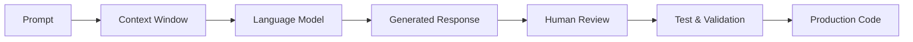

# Chapter 3 — Understanding Large Language Models for Software Engineers

> *You do not need to become an AI researcher to use AI effectively, but you do need to understand how modern language models generate text, where that mechanism breaks down, and what that means for the code you ship.*

## Learning Objectives

By the end of this chapter, you will be able to:

- Explain what a [Large Language Model (LLM)](../glossary.md#llm) is, precisely enough to be useful.
- Distinguish between training, [fine-tuning](../glossary.md#fine-tuning), [inference](../glossary.md#inference), and [tool use](../glossary.md#tool-use) — and know which one you interact with day to day.
- Explain [tokens](../glossary.md#token) and [context windows](../glossary.md#context-window) well enough to reason about why a model "forgot" something earlier in a long session.
- Recognize why [hallucinations](../glossary.md#hallucination) happen, and predict the situations where they're most likely.
- Apply a concrete, repeatable set of practices for using LLMs safely in professional software engineering.

---

## 3.1 Why Software Engineers Should Understand This

Modern AI assistants appear to "understand" programming languages, system architecture and human intent, but not in the sense that a compiler understands syntax. An LLM is a statistical model of language, and everything it produces, including code, is generated one token at a time based on probability, not by executing logic or checking facts against a source of truth.

Many current models are marketed as "reasoning" or "thinking" models. They work through a problem in text before giving a final answer, which often improves results on multi-step problems such as debugging. But those steps come from the same token-by-token mechanism and can contain mistakes; well-written reasoning doesn't guarantee a correct conclusion. Treat a reasoning model's output as a better draft, not a verified one.

This explains why a model can write a syntactically perfect function that calls a method which doesn't exist, why the same question can get two different answers, and why the fix for many "the AI got this wrong" situations is better context or a verification step, not a better model. Understanding the mechanism lets you use AI with calibrated confidence instead of blind trust or reflexive distrust.

---

## 3.2 What Is a Large Language Model?

A **Large Language Model (LLM)** is a neural network trained on very large collections of text and code. During training, it learns statistical relationships between **tokens** — the sub-word units (roughly, word fragments and code symbols) that models operate on instead of raw text.

When it generates a response, the model doesn't look up stored facts or execute logic. At each step, it computes how likely every token in its vocabulary is to come next, given everything in the context window. The application picks one token from that distribution, appends it, and repeats.

The picking step is called **sampling**. Settings such as **[temperature](../glossary.md#temperature)** control how random it is: a low temperature makes the model favor the most likely tokens, and a higher one spreads choices across less likely tokens too. Because most tools sample with some randomness, the same [prompt](../glossary.md#prompt) can produce different answers on different runs. That's expected, not a malfunction.

Before any of this happens, text is split into tokens by a **tokenizer**. Each model family has its own, so the same text gives different token counts in different models. Here's a short piece of code run through OpenAI's open-source `tiktoken` library. It's used here only because it's easy to install. Other models, including Claude, split text differently, so the exact numbers illustrate the idea rather than count tokens for the model you use:

```bash
pip install tiktoken
```

```python
import tiktoken

encoding = tiktoken.get_encoding("cl100k_base")

code = "def add(a, b):\n    return a + b"
tokens = encoding.encode(code)

print(f"Text: {code!r}")
print(f"Token count: {len(tokens)}")
print(f"Token IDs: {tokens}")
for t in tokens:
    print(f"  {t:>6}  ->  {encoding.decode([t])!r}")
```

```text
Text: 'def add(a, b):\n    return a + b'
Token count: 11
Token IDs: [755, 923, 2948, 11, 293, 997, 262, 471, 264, 489, 293]
     755  ->  'def'
     923  ->  ' add'
    2948  ->  '(a'
      11  ->  ','
     293  ->  ' b'
     997  ->  '):\n'
     262  ->  '   '
     471  ->  ' return'
     264  ->  ' a'
     489  ->  ' +'
     293  ->  ' b'
```

(Output from `tiktoken` 0.14.0.) Words and tokens don't line up one-to-one. `def add(a, b):` becomes several tokens, some of them partial words or punctuation clusters, and the four-space indent is split between a three-space token and the space at the start of `' return'`. This matters because context windows, API pricing and "how much can I paste into one prompt" are all measured in tokens, not characters or words. A 3,000-line file isn't safe to paste into one prompt just because it looks manageable. Check the token count, ideally with the tokenizer or token-counting tool your provider offers.

The model isn't searching the internet or reading your repository unless a tool gives it that ability — file access, web search, or a connected code index. Otherwise, everything it produces comes from patterns learned in training plus whatever is in the current context window.

---

## 3.3 Training, Fine-Tuning, and Inference

| Phase | Purpose | Who does this |
|---|---|---|
| Pre-training | Learn language and code patterns from massive datasets | The model provider (e.g., Anthropic, OpenAI) |
| Fine-tuning / [RLHF](../glossary.md#rlhf) | Shape behavior for helpfulness, safety, and specific tasks | The model provider |
| Inference | Generate a response to your prompt | You, every time you send a message |
| Tool use | Access external knowledge or take actions (search, run code, call APIs) | You, by enabling and invoking tools |

Most engineers only ever interact with the last two rows. That reframes a lot of "prompting technique" advice: you aren't teaching the model anything permanent when you talk to it. Nothing you type during inference changes the model's weights, the numbers it learned during training. Every new conversation starts from the same trained model, which is why the context you provide in *this* session carries so much weight.

---

## 3.4 Tokens and Context Windows

A **context window** is the total amount of text, in tokens, a model can consider at once. One budget covers:

- System instructions (behavior rules set by the application)
- Your prompts
- Conversation history
- Retrieved documents or file contents
- Tool outputs (search results, command output, etc.)

When the total would exceed the window, tools handle it in different ways:

- **Truncating** — dropping the oldest messages or the start of the input, often silently.
- **Summarizing or compacting** — replacing older parts of the conversation with a shorter summary, which keeps the gist but loses detail.
- **Returning an error** — refusing the request until you shorten it, which is common when calling a model's API directly.

In the first two cases, earlier messages usually stay visible in your chat history even though the model no longer sees them in full. This explains a familiar failure: late in a long session, the model seems to forget a constraint you gave an hour ago, because it was dropped or summarized away.

A full context isn't the only problem. Even when everything fits, models tend to use information at the beginning and end of a long context more reliably than information in the middle (see Further Reading). Putting key constraints near the end of your prompt, or restating them, is a cheap workaround.

You can see the context budget directly with a local model. With Ollama:

```bash
ollama show hermes3:8b
```

```text
  Model
    architecture        llama
    parameters          8.0B
    context length      131072
    embedding length    4096
    quantization        Q4_0

  Capabilities
    completion
    tools

  Parameters
    stop    "<|im_start|>"
    stop    "<|im_end|>"

  License
    META LLAMA 3 COMMUNITY LICENSE AGREEMENT
    Meta Llama 3 Version Release Date: April 18, 2024
    ...
```

The `context length` of 131,072 tokens is the most this model *can* handle. It isn't what you get by default. Send the model a prompt, then check what Ollama actually loaded:

```bash
ollama ps
```

```text
NAME          ID              SIZE      PROCESSOR    CONTEXT    UNTIL
hermes3:8b    4f6b83f30b62    4.9 GB    100% CPU     4096       4 minutes from now
```

(Output from Ollama 0.23.2 on a Raspberry Pi 5 with 8 GB of RAM.) Ollama picks a default based on the GPU memory it finds, and a machine with none, like the Pi, gets the smallest: 4,096 tokens. That's the entire budget, shared by the [system prompt](../glossary.md#system-prompt), conversation history, and the generated response. Defaults change between Ollama versions, so check with `ollama ps`.

You can raise the limit for a single session with `/set parameter num_ctx 8192` inside `ollama run`, by passing `num_ctx` in the `options` of an API request, or for the whole server with the `OLLAMA_CONTEXT_LENGTH` environment variable. A larger context needs more memory, though, and on hardware like a Raspberry Pi 5 that's a real limit: a smaller window means shorter conversations, less pasted code and more careful context management than with a cloud model offering 100K+ tokens. If you run models locally (Chapter 5 shows how), plan around the context budget.

---

## 3.5 Why Hallucinations Happen

A **hallucination** is generated content that is fluent and plausible but wrong. In code, it shows up as invented API methods, wrong command-line flags, nonexistent libraries or functions, misquoted documentation, or confident assumptions about business rules the model was never told.

Hallucinations aren't a bug that gets patched out; they follow from how generation works. The model always produces the *statistically likely* continuation of the text so far, not a verified fact. When the answer is well represented in training data and the prompt is specific, likely and correct usually coincide. When the prompt is vague, the information wasn't in the training data, or a library changed after the model's training cutoff, they diverge, and the model has no internal signal that it's happening. It writes the wrong answer as fluently as the right one.

An example — asking a model, with no project context, for a specific method:

```
Prompt: "Show me how to use the retry decorator from the requests library."
```

`requests` has no retry decorator. Retries are usually done with `urllib3.util.retry.Retry` and `requests.adapters.HTTPAdapter`, or with a separate package such as `tenacity`. A model may still produce a clean, confident example calling `requests.retry(...)`, because the name is *plausible*, even though it doesn't exist. Fluency and correctness are independent properties of the output, and only fluency is guaranteed.

**Practical mitigation:** when you're not sure an API is real, check it against the documentation or the installed package before it goes near a commit — `pip show requests`, the official docs, or a quick `python -c "import requests; help(requests)"` are cheaper than debugging a hallucinated method three commits later.

---

## 3.6 Strengths of Modern LLMs

Modern models are strong at a recognizable set of tasks:

- Explaining existing code, including large or unfamiliar codebases
- Summarizing documentation, tickets, and long discussion threads
- Translating logic between programming languages
- Generating repetitive, well-specified code (boilerplate, CRUD, data transformations)
- Producing a first draft of documentation from working code
- Brainstorming multiple implementation approaches quickly

This is why the book treats AI as a capable assistant rather than an autonomous developer. Assistant work — drafting, explaining, summarizing, proposing — is where the gap between fluency and correctness matters least, because a human reviews the output before it has consequences. Autonomous work — merging without review, deploying without testing — is where that gap becomes expensive:


```mermaid
flowchart LR
A[Prompt] --> B[Context Window]
B --> C[Language Model]
C --> D[Generated Response]
D --> E[Human Review]
E --> F[Test & Validation]
F --> G[Production Code]
```

The first three boxes are mechanical and probabilistic. The last three are where engineering judgment lives, and no improvement in models makes them optional.

---

## 3.7 Practical Guidelines

The prompting basics in [Chapter 0, Section 0.5](../00-before-you-begin.md#05-prompting-basics) — give context, state the goal, add constraints, ask for assumptions, iterate — are the starting point. This chapter's mechanics add four more:

1. **Request incremental changes** — one function or component at a time. Shorter responses are easier to verify, and less of your context window is spent on code you'll throw away.
2. **Read every result** — don't just skim that it "looks right." Fluency is not evidence (Section 3.5).
3. **Run automated tests** against generated code, as you would against a new contributor's pull request.
4. **Review security explicitly** — input validation, auth checks and unsafe defaults are easy to generate plausibly and easy to skip in review.

Asking for assumptions deserves an example, because it catches many misunderstandings before any code exists:

```
Before writing the implementation, list any assumptions you're making about:
- Input validation requirements
- Expected data types and ranges
- Error handling behavior
- Any existing conventions in this codebase you're inferring

Then wait for me to confirm or correct them before generating code.
```

Tools don't always follow this instruction (Chapter 6, Section 6.2 shows one that didn't), so if the assumptions matter, ask for them in a separate prompt before any code.

---

## Engineering Insight

> The quality of an AI response is determined as much by the quality of the context you provide as by the raw capability of the model itself.

---

## Common Mistakes

- Assuming the model "knows" your project just because you're deep into a conversation about it.
- Accepting generated code without running it, let alone testing it.
- Asking for an entire application or feature in a single prompt, making review effectively impossible.
- Ignoring compiler warnings, linter output, or static analysis flags on generated code.
- Treating a confident tone as evidence of correctness — confidence and accuracy are generated independently.

---

## Hands-On Lab: Tokens, Context, and Hallucination in Practice

This lab has three steps, each showing a concept from this chapter in practice.

**Step 1 — See tokenization yourself.** Run a version of the Section 3.2 script on a real file from one of your projects:

```python
import tiktoken

encoding = tiktoken.get_encoding("cl100k_base")

with open("your_file.py", "r") as f:
    code = f.read()

tokens = encoding.encode(code)
print(f"File: your_file.py")
print(f"Characters: {len(code)}")
print(f"Tokens: {len(tokens)}")
print(f"Ratio: {len(code) / len(tokens):.2f} chars/token")
```

*Illustrative: replace `your_file.py` with a real file. This script isn't run by the book's tests.*

Compare the character count to the token count. This ratio is roughly what you budget against when you paste large files into a prompt. The count will differ for the model you use, which has its own tokenizer.

**Step 2 — Trigger a hallucination.** Pick a library you know well and ask an AI assistant how to use a method or flag that sounds plausible but doesn't exist, such as a made-up flag on a CLI tool you use often. Note how confidently it answers, then check the documentation or `--help` output.

**Step 3 — Test the context window limit.** With Ollama running locally (Chapter 5), start a conversation and state a constraint early, such as "always use snake_case for variable names." Paste a large amount of unrelated code or text, then ask for something that depends on the constraint. Does the model still apply it? Relate what you see to Section 3.4. If you haven't set up Ollama yet, come back to this step after Chapter 5, Section 5.6.

Record your findings for all three steps. They're the start of your own sense of when to trust AI output and when to slow down and verify.

---

## Chapter Summary

Large Language Models are probabilistic systems that generate text one token at a time — not databases and not compilers. Even "reasoning" models generate their reasoning steps the same way, so those steps can be wrong too. This mechanism explains both their fluency and their most common failure, hallucination. Engineers who understand tokens, context windows and hallucinations give better context, ask more precise questions, and know where verification can't be skipped.

---

## Review Questions

1. What is an LLM, and what does it actually do at inference time?
2. Explain the difference between training and inference, and why that distinction matters for how you use AI day to day.
3. Why do hallucinations occur, and why can't they simply be "fixed" with a better model?
4. What is a context window, and what practical problem does exceeding it cause?
5. List five practices from this chapter that measurably improve the quality of AI-generated software, and explain why each one works.

---

## Further Reading

- Nelson F. Liu et al., ["Lost in the Middle: How Language Models Use Long Contexts"](https://arxiv.org/abs/2307.03172), *Transactions of the Association for Computational Linguistics*, 2023. The source for the finding in Section 3.4 that models use information in the middle of a long context less reliably.
- [Ollama documentation: context length](https://docs.ollama.com/context-length). How Ollama chooses a default context length and how to change it.
- [`tiktoken` on GitHub](https://github.com/openai/tiktoken). The tokenizer library used in Section 3.2.

---

## Next Chapter

Chapter 4 follows AI through the complete software development lifecycle, from requirements to operations, and shows the quality gates and CI configuration that keep humans in control. It also covers working safely with AI agents.
