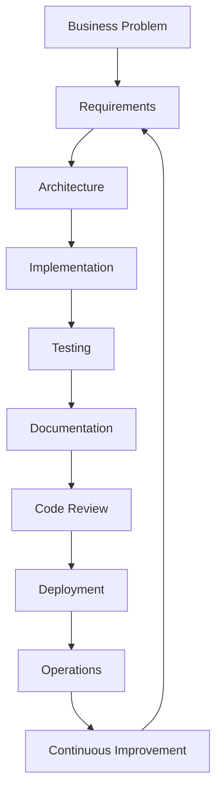

# Chapter 4 — The AI-Assisted Software Development Lifecycle

> *AI delivers the greatest value when it is integrated into an engineering process, not treated as a shortcut around one.*

## Learning Objectives

By the end of this chapter, you will be able to:

- Map AI capabilities to every phase of the SDLC, with concrete examples at each stage.
- Build a repeatable AI-assisted engineering workflow you can apply to any feature.
- Define and enforce quality gates that keep humans in control of every consequential decision.
- Integrate testing, documentation, and review into every iteration — not as separate, deferrable steps.

---

## 4.1 Beyond Code Generation

Many developers first encounter AI as a code generator, and it's easy to stop there. Professional teams quickly discover that the greatest value comes from using AI across the entire software lifecycle — not just during implementation, where it's most visible but arguably least differentiated from what a good IDE autocomplete already offered.

AI can clarify requirements, analyze existing systems, propose designs, generate code, create tests, draft documentation, review changes, and help explain production incidents. This chapter walks through each of those phases with specific, usable techniques — not just the observation that AI "can help."

---

## 4.2 The AI-Assisted SDLC



Every stage benefits from AI assistance, and every stage also requires human verification before its output feeds into the next one. Note the loop back from Continuous Improvement to Requirements — this isn't a linear pipeline you run once per feature; it's a cycle each feature moves through, and lessons from operations feed back into how the next requirement gets written.

---

## 4.3 Phase-by-Phase Guidance

### Requirements

Use AI to stress-test a specification before any code is written — identifying ambiguity, conflicting requirements, missing acceptance criteria, unconsidered stakeholders, and edge cases. A concrete prompt pattern that works well:

```
Here is a draft user story:
"As a user, I want to reset my password so I can regain access to my account."

Review this for:
1. Missing acceptance criteria
2. Unstated edge cases (expired links, concurrent requests, etc.)
3. Security requirements that should be explicit
4. Ambiguous terms that could be interpreted multiple ways

List your findings as questions I need to answer, not as assumptions you're making on my behalf.
```

That last line matters — it's the difference between AI helping you find gaps and AI quietly filling them with guesses.

### Architecture

Ask AI to compare architectural styles and articulate trade-offs across scalability, security, cost, and maintainability — as an input to your decision, not the decision itself:

```
I need to add background job processing to a Django app currently deployed
on a single EC2 instance, expecting roughly 10,000 jobs/day, with jobs
taking 1–30 seconds each.

Compare these three approaches: Celery + Redis, AWS SQS + Lambda, and
a simple database-backed job table with a polling worker. For each,
cover: operational complexity, cost at this scale, failure handling,
and what changes if volume grows 10x.
```

### Implementation

Generate one logical component at a time. Keep commits small, readable, and independently testable — this is where the "incremental over one-shot" principle from Chapter 1 becomes a concrete git habit:

```bash
# One logical unit of work per commit, each independently reviewable
git add app/auth/password_reset.py
git commit -m "Add password reset token generation with 15-min expiry"

git add tests/auth/test_password_reset.py
git commit -m "Add tests for password reset token generation"

git add app/auth/views.py
git commit -m "Wire password reset endpoint to token generation"
```

Each commit here corresponds to a single AI-assisted generation step that was reviewed before moving to the next. A commit history that reads like this is also a debugging aid months later — `git bisect` is far more useful against small, single-purpose commits than one 800-line "implement password reset" commit.

### Testing

Generate unit, integration, regression, and boundary tests — and treat every generated test as a draft until you've confirmed it actually tests the right thing, not just that it passes:

```python
# tests/auth/test_password_reset.py
import pytest
from datetime import datetime, timedelta
from app.auth.password_reset import generate_reset_token, verify_reset_token

class TestPasswordResetToken:
    def test_token_is_generated(self):
        token = generate_reset_token(user_id=1)
        assert token is not None
        assert len(token) >= 32

    def test_token_verifies_correctly(self):
        token = generate_reset_token(user_id=1)
        assert verify_reset_token(token) == 1

    def test_expired_token_is_rejected(self):
        token = generate_reset_token(user_id=1, expiry_minutes=-1)
        with pytest.raises(TokenExpiredError):
            verify_reset_token(token)

    def test_token_is_single_use(self):
        token = generate_reset_token(user_id=1)
        verify_reset_token(token)
        with pytest.raises(TokenAlreadyUsedError):
            verify_reset_token(token)

    def test_malformed_token_is_rejected(self):
        with pytest.raises(InvalidTokenError):
            verify_reset_token("not-a-real-token")
```

Run it the same way you'd run any test suite before trusting the implementation it covers:

```bash
pytest tests/auth/test_password_reset.py -v
```

```text
tests/auth/test_password_reset.py::TestPasswordResetToken::test_token_is_generated PASSED
tests/auth/test_password_reset.py::TestPasswordResetToken::test_token_verifies_correctly PASSED
tests/auth/test_password_reset.py::TestPasswordResetToken::test_expired_token_is_rejected PASSED
tests/auth/test_password_reset.py::TestPasswordResetToken::test_token_is_single_use PASSED
tests/auth/test_password_reset.py::TestPasswordResetToken::test_malformed_token_is_rejected PASSED

======================== 5 passed in 0.14s ========================
```

The single-use and expiry tests here aren't things a model reliably generates unprompted — they came from explicitly asking for edge cases, echoing the security requirements identified back in the Chapter 1 case study. Generated tests are only as thorough as the edge cases you asked for.

### Documentation

Use AI to draft README files, API documentation, architecture summaries, release notes, and user guides directly from working code — then verify every factual claim against the actual implementation before publishing it:

```
Generate API documentation for this Flask endpoint. Include the request
schema, response schema, all possible status codes with their triggers,
and one example request/response pair. Base every claim strictly on the
code below — do not describe behavior the code doesn't actually implement.

[paste endpoint code]
```

That last sentence is doing real work — it's a direct countermeasure against the hallucination behavior covered in Chapter 3, applied specifically to documentation generation, where a plausible but wrong claim is especially costly because readers trust docs by default.

### Review

Review AI-generated code using automated analysis, peer review, and AI-assisted review before merging — treating AI-assisted review as one more input, not a replacement for a human reviewer's sign-off:

```bash
# Automated checks first — cheap, fast, catches mechanical issues
ruff check app/auth/password_reset.py
mypy app/auth/password_reset.py
bandit -r app/auth/  # security-focused static analysis
```

```text
app/auth/password_reset.py:23:5: S105 Possible hardcoded password: 'temp_token'
```

A tool like `bandit` catching something like this before a human even looks at the diff is a good example of automated and human review working together — it's a cheap first pass that narrows what a human reviewer needs to focus attention on.

### Operations

Summarize logs, explain failures, identify likely causes, and propose recovery steps — while validating every recommendation against what actually happened, not what sounds like a typical root cause:

```
Here are the last 200 log lines from the password-reset service during
an incident window. Summarize the error pattern, propose the most likely
root cause, and suggest what additional data I should pull to confirm it
before I act on this.

[paste logs]
```

Asking explicitly for "what additional data to confirm this" before acting is the operational equivalent of asking for assumptions before code generation — it keeps a plausible-sounding diagnosis from being treated as a confirmed one.

---

## 4.4 Human Quality Gates

Certain checkpoints should never be bypassed, regardless of how much AI assistance was involved in getting to that point:

| Phase | Required Validation |
|---|---|
| Requirements | Business/stakeholder approval |
| Design | Architecture review by a human engineer |
| Code | Automated tests passing **and** peer review |
| Deployment | Release approval per your team's process |
| Production | Active monitoring and a defined rollback plan |

These gates are what let a team move fast with AI without quietly eroding quality. A simple way to enforce the "tests + review" gate mechanically rather than relying on discipline alone is a CI check that blocks merges without both:

```yaml
# .github/workflows/quality-gate.yml
name: Quality Gate

on:
  pull_request:
    branches: [main]

jobs:
  test-and-lint:
    runs-on: ubuntu-latest
    steps:
      - uses: actions/checkout@v4
      - uses: actions/setup-python@v5
        with:
          python-version: "3.12"
      - run: pip install -r requirements.txt -r requirements-dev.txt
      - name: Run tests
        run: pytest --cov=app --cov-fail-under=80
      - name: Lint
        run: ruff check .
      - name: Security scan
        run: bandit -r app/
      - name: Require review approval
        run: echo "Branch protection enforces required reviewers separately"
```

Pairing this with a branch protection rule (`Settings → Branches → Require pull request reviews before merging`) turns "we review AI-generated code" from a stated policy into something the repository actually enforces.

---

## Engineering Insight

> AI should shorten feedback loops — not remove them.

---

## Common Mistakes

- Beginning implementation before requirements are actually clear, treating AI's fluent output as a substitute for that clarity.
- Asking AI to generate an entire application or feature in one request, making meaningful review impossible.
- Skipping documentation because AI "can generate it later" — later rarely comes, and undocumented AI-assisted code is harder to trust than undocumented hand-written code, precisely because no one is certain what was verified.
- Merging generated code without running the test suite against it.
- Treating AI recommendations — architectural or otherwise — as design decisions rather than as one input to a decision a human still needs to make.

---

## Practical Workflow

1. Define the business objective clearly enough to write down.
2. Build project context — relevant files, constraints, prior decisions — before prompting.
3. Ask AI to analyze the task and surface questions or alternatives.
4. Review the alternatives and choose deliberately.
5. Implement incrementally, one reviewable unit at a time.
6. Test continuously, not as a final gate before merge.
7. Document changes as they're made, not retroactively.
8. Review and deploy through the quality gates in Section 4.4.

Repeat this cycle for every feature, regardless of size — the overhead scales down naturally for small features, but skipping steps entirely is where quality erodes.

---

## Hands-On Lab: Run One Feature Through the Full Lifecycle

Choose a feature from one of your own projects — ideally something small enough to complete in a single sitting but real enough to touch requirements, code, and tests.

For each SDLC phase in Section 4.3, record in a short log:

- How AI assisted at this phase, with the actual prompt you used.
- What required human judgment that AI couldn't have supplied.
- Which quality gate applied, and whether you actually enforced it.
- What you'd change about the workflow next time.

If your project has a CI setup, adapt the quality-gate YAML from Section 4.4 to it and confirm a pull request without passing tests or without a review is actually blocked — don't just assume the configuration works.

> **Screenshot placeholder:** Capture the GitHub Actions run showing the quality gate passing (or correctly failing) on a real pull request, and a screenshot of the branch protection settings enforcing required reviews. Insert both here in the published version.

---

## Chapter Summary

AI is most effective when embedded in a disciplined engineering lifecycle, contributing at every phase from requirements through operations rather than only during implementation. It strengthens established software engineering practices — clarifying requirements, comparing architectures, generating tests, drafting documentation — without replacing the human judgment and accountability that quality gates exist to protect.

---

## Review Questions

1. Why is AI more valuable across the entire SDLC than only during coding?
2. What are quality gates, and why should they never be bypassed regardless of AI involvement?
3. Which SDLC phases benefit most from AI assistance, and which require the closest human scrutiny?
4. Why should implementations proceed incrementally, and what does a well-structured commit history reveal about whether that happened?
5. Describe a complete AI-assisted workflow for a new feature, including which quality gate applies at each step.

---

## Preview

Chapter 5 focuses on building a professional AI-assisted development environment — editors, version control, testing tools, and AI integrations — including a working setup on both a cloud-connected workstation and a self-hosted Raspberry Pi 5 environment.
