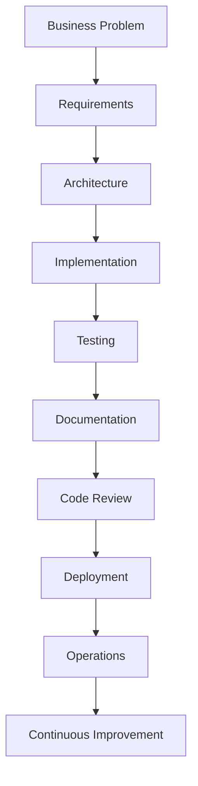

# Chapter 4 – The AI-Assisted Software Development Lifecycle

> *AI delivers the greatest value when it is integrated into an engineering process, not treated as a shortcut around one.*

## Learning Objectives

- Map AI capabilities to every phase of the SDLC.
- Build a repeatable AI-assisted engineering workflow.
- Define quality gates that keep humans in control.
- Integrate testing, documentation, and review into every iteration.

---

# 4.1 Beyond Code Generation

Many developers first encounter AI as a code generator. Professional teams quickly discover that the greatest value comes from using AI throughout the entire software lifecycle rather than only during implementation.

AI can clarify requirements, analyse existing systems, propose designs, generate code, create tests, draft documentation, review changes, and explain production incidents.

---

# 4.2 The AI-Assisted SDLC

Every stage benefits from AI, but every stage also requires human verification.

---

# 4.3 Phase-by-Phase Guidance

## Requirements

Use AI to identify ambiguity, conflicting requirements, missing acceptance criteria, stakeholders, and edge cases.

## Architecture

Ask AI to compare architectural styles, identify trade-offs, and evaluate scalability, security, and maintainability.

## Implementation

Generate one logical component at a time. Keep commits small, readable, and independently testable.

## Testing

Generate unit, integration, regression, and boundary tests. Treat generated tests as drafts until reviewed.

## Documentation

Use AI to draft README files, API documentation, architecture summaries, release notes, and user guides.

## Review

Review AI-generated code using automated analysis, peer review, and AI-assisted review before merging.

## Operations

Summarise logs, explain failures, identify likely causes, and propose recovery steps while validating every recommendation.

---

# 4.4 Human Quality Gates

Never bypass these checkpoints:

| Phase | Required Validation |
|--------|---------------------|
| Requirements | Business approval |
| Design | Architecture review |
| Code | Automated tests + peer review |
| Deployment | Release approval |
| Production | Monitoring and rollback plan |

Quality gates preserve engineering discipline while allowing AI to accelerate delivery.

---

# Engineering Insight

> AI should shorten feedback loops—not remove them.

---

# Common Mistakes

- Beginning implementation before requirements are clear.
- Asking AI to generate an entire application in one request.
- Skipping documentation because AI "can generate it later."
- Merging generated code without testing.
- Treating AI recommendations as design decisions.

---

# Practical Workflow

1. Define the business objective.
2. Build the project context.
3. Ask AI to analyse the task.
4. Review alternatives.
5. Implement incrementally.
6. Test continuously.
7. Document changes.
8. Review and deploy.

Repeat this cycle for every feature.

---

# Hands-On Lab

Choose a feature from one of your projects.

For each SDLC phase, record:

- How AI assisted.
- What required human judgement.
- Which quality gates were applied.
- What improvements you would make to the workflow.

---

# Chapter Summary

AI is most effective when embedded in a disciplined engineering lifecycle. Rather than replacing established software engineering practices, it strengthens them by accelerating analysis, implementation, testing, documentation, and review while leaving accountability with the engineering team.

---

# Review Questions

1. Why is AI more valuable across the SDLC than only during coding?
2. What are quality gates?
3. Which SDLC phases benefit most from AI?
4. Why should implementations be incremental?
5. Describe a complete AI-assisted workflow for a new feature.

---

# Preview

Chapter 5 focuses on creating a professional AI-assisted development environment, including editors, version control, testing tools, and AI integrations that support high-quality engineering.
