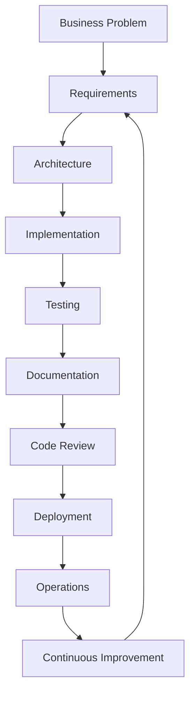

# Chapter 4 — The AI-Assisted Software Development Lifecycle

> *AI delivers the greatest value when it is integrated into an engineering process, not treated as a shortcut around one.*

## Learning Objectives

By the end of this chapter, you will be able to:

- Map AI capabilities to every phase of the SDLC, with concrete examples at each stage.
- Build a repeatable AI-assisted engineering workflow you can apply to any feature.
- Define and enforce quality gates that keep humans in control of every consequential decision.
- Integrate testing, documentation and review into every iteration.
- Work safely with AI [agents](../glossary.md#agent): review diffs, choose permission settings, keep tasks small, and give the agent a context file.

---

## 4.1 Beyond Code Generation

Many developers first meet AI as a code generator and stop there. The larger value comes from using AI across the whole lifecycle, not just in implementation, where it's most visible but adds least beyond what good autocomplete already offered.

AI can clarify requirements, analyze existing systems, propose designs, generate code, create tests, draft documentation, review changes and help explain production incidents. This chapter gives a concrete technique for each phase.

---

## 4.2 The AI-Assisted SDLC


```mermaid
flowchart TD
A[Business Problem] --> B[Requirements]
B --> C[Architecture]
C --> D[Implementation]
D --> E[Testing]
E --> F[Documentation]
F --> G[Code Review]
G --> H[Deployment]
H --> I[Operations]
I --> J[Continuous Improvement]
J --> B
```

Every stage benefits from AI assistance, and every stage needs human verification before its output feeds the next. Note the loop back from Continuous Improvement to Requirements: lessons from operations shape how the next requirement is written.

Within each stage, use the eight-step workflow from [Chapter 1, Section 1.8](01-introduction.md#18-the-workflow-used-throughout-this-book). This chapter adds what is specific to each phase: the [prompts](../glossary.md#prompt) that work, the checks that matter, and the quality gates in Section 4.4 that a change must pass before it ships.

---

## 4.3 Phase-by-Phase Guidance

### Requirements

Use AI to stress-test a specification before any code is written: ambiguity, conflicting requirements, missing acceptance criteria, forgotten stakeholders and edge cases. A prompt pattern that works well:

```
Here is a draft user story:
"As a user, I want to reset my password so I can regain access to my account."

Review this for:
1. Missing acceptance criteria
2. Unstated edge cases (expired links, concurrent requests, etc.)
3. Security requirements that should be explicit
4. Ambiguous terms that could be interpreted multiple ways

List your findings as questions I need to answer, not as assumptions you're making on my behalf.
```

The last line is the difference between AI helping you find gaps and AI filling them with guesses.

### Architecture

Ask AI to compare architectural options and their trade-offs in scalability, security, cost and maintainability, as an input to your decision, not the decision itself:

```
I need to add background job processing to a Django app currently deployed
on a single EC2 instance, expecting roughly 10,000 jobs/day, with jobs
taking 1–30 seconds each.

Compare these three approaches: Celery + Redis, AWS SQS + Lambda, and
a simple database-backed job table with a polling worker. For each,
cover: operational complexity, cost at this scale, failure handling,
and what changes if volume grows 10x.
```

You don't need these names for the rest of this book; a realistic architecture prompt names the real options. In brief: **Django** is a Python web framework; **EC2** rents virtual servers on Amazon's cloud; **Celery** runs Python tasks in the background, often using **Redis**, an in-memory data store, as its queue; **SQS** is Amazon's managed message queue; and **Lambda** runs a function on demand without a server to manage. What matters is the prompt's structure: your current setup and scale, the options, and the criteria to compare them on.

### Implementation

Generate one logical component at a time. Keep commits small, readable and independently testable; this is where the "small iterations" principle from Chapter 1 becomes a git habit:

```bash
# One logical unit of work per commit, each independently reviewable
git add app/auth/password_reset.py
git commit -m "Add password reset token generation with 15-min expiry"

git add tests/auth/test_password_reset.py
git commit -m "Add tests for password reset token generation"

git add app/auth/views.py
git commit -m "Wire password reset endpoint to token generation"
```

Each commit is one AI-assisted step, reviewed before the next. Such a history also helps debugging months later: `git bisect` is far more useful on small, single-purpose commits than on one 800-line "implement password reset" commit.

### Testing

Generate unit, integration, regression and boundary tests, and treat each generated test as a draft until you've confirmed it tests the right thing, not just that it passes:

```python
# tests/auth/test_password_reset.py
import pytest

from app.auth.password_reset import (
    InvalidTokenError,
    TokenAlreadyUsedError,
    TokenExpiredError,
    generate_reset_token,
    verify_reset_token,
)


class TestPasswordResetToken:
    def test_token_is_generated(self):
        token = generate_reset_token(user_id=1)
        assert token is not None
        assert len(token) >= 32

    def test_token_verifies_correctly(self):
        token = generate_reset_token(user_id=1)
        assert verify_reset_token(token) == 1

    def test_expired_token_is_rejected(self):
        token = generate_reset_token(user_id=1, expiry_minutes=-1)
        with pytest.raises(TokenExpiredError):
            verify_reset_token(token)

    def test_token_is_single_use(self):
        token = generate_reset_token(user_id=1)
        verify_reset_token(token)
        with pytest.raises(TokenAlreadyUsedError):
            verify_reset_token(token)

    def test_malformed_token_is_rejected(self):
        with pytest.raises(InvalidTokenError):
            verify_reset_token("not-a-real-token")
```

The implementation these tests cover (random tokens from Python's `secrets` module, a 15-minute expiry, and single use) is in the book's companion code at [`examples/ch04-password-reset/`](https://github.com/ashwinkrpi/ai-assisted-development-book/tree/main/examples/ch04-password-reset). Run the tests before you trust the implementation they cover:

```bash
pytest tests/auth/test_password_reset.py -v --no-header
```

```text
============================= test session starts ==============================
collecting ... collected 5 items

tests/auth/test_password_reset.py::TestPasswordResetToken::test_token_is_generated PASSED [ 20%]
tests/auth/test_password_reset.py::TestPasswordResetToken::test_token_verifies_correctly PASSED [ 40%]
tests/auth/test_password_reset.py::TestPasswordResetToken::test_expired_token_is_rejected PASSED [ 60%]
tests/auth/test_password_reset.py::TestPasswordResetToken::test_token_is_single_use PASSED [ 80%]
tests/auth/test_password_reset.py::TestPasswordResetToken::test_malformed_token_is_rejected PASSED [100%]

============================== 5 passed in 0.02s ===============================
```

`--no-header` hides your Python version and file paths, so your output should match apart from the timing.

Models don't reliably generate single-use and expiry tests unprompted. These came from asking for edge cases, based on the security requirements in the Chapter 1 case study. Generated tests are only as thorough as the edge cases you ask for.

### Documentation

Use AI to draft READMEs, API documentation, architecture summaries, release notes and user guides from working code, then check every claim against the implementation before publishing:

```
Generate API documentation for this Flask endpoint. Include the request
schema, response schema, all possible status codes with their triggers,
and one example request/response pair. Base every claim strictly on the
code below — do not describe behavior the code doesn't actually implement.

[paste endpoint code]
```

(**Flask** is a small Python web framework; an endpoint is a function that handles requests to one URL.)

The last sentence of the prompt guards against the [hallucination](../glossary.md#hallucination) described in Chapter 3. In documentation a plausible but wrong claim is especially costly, because readers trust docs by default.

### Review

Review AI-generated code with automated analysis, peer review and AI-assisted review before merging. AI review is one more input, not a replacement for a human reviewer's sign-off.

Suppose an AI assistant's first draft of the token generator looked like this:

```python
# review/password_reset_draft.py
# A flawed first draft, written to show what automated review catches.
# Don't copy it: the real version is app/auth/password_reset.py.
def generate_reset_token(user_id: int) -> str:
    temp_token = "reset-123456"
    return f"{user_id}-{temp_token}"
```

Run automated checks first: they're cheap, fast, and catch mechanical issues. Ruff's `S` rules check for security problems:

```bash
ruff check --select S review/password_reset_draft.py
```

```text
S105 Possible hardcoded password assigned to: "temp_token"
 --> review/password_reset_draft.py:5:18
  |
3 | # Don't copy it: the real version is app/auth/password_reset.py.
4 | def generate_reset_token(user_id: int) -> str:
5 |     temp_token = "reset-123456"
  |                  ^^^^^^^^^^^^^^
6 |     return f"{user_id}-{temp_token}"
  |

Found 1 error.
```

Ruff's `S` rules port the checks of `bandit`, a dedicated security scanner, which reports the same problem as `B105`. Either tool catches this before a human reads the diff, so the reviewer can focus on what tools can't judge, such as whether a fixed token makes the whole reset flow predictable.

### Operations

Use AI to summarize logs, explain failures, suggest likely causes and propose recovery steps, and check every recommendation against what happened, not what sounds like a typical root cause:

```
Here are the last 200 log lines from the password-reset service during
an incident window. Summarize the error pattern, propose the most likely
root cause, and suggest what additional data I should pull to confirm it
before I act on this.

[paste logs]
```

Asking for "what additional data I should pull to confirm it" is the operations version of asking for assumptions before code. It stops a plausible diagnosis from being treated as a confirmed one.

---

## 4.4 Human Quality Gates

Some checkpoints should never be bypassed, however much AI was involved:

| Phase | Required Validation |
|---|---|
| Requirements | Business/stakeholder approval |
| Design | Architecture review by a human engineer |
| Code | Automated tests passing **and** peer review |
| Deployment | Release approval per your team's process |
| Production | Active monitoring and a defined rollback plan |

These gates let a team move fast with AI without eroding quality. To enforce the "tests and review" gate mechanically instead of relying on discipline, use a CI (continuous integration) check, an automated job that runs on every pull request, together with a review rule:

```yaml
# .github/workflows/quality-gate.yml
name: Quality Gate

on:
  pull_request:
    branches: [main]

jobs:
  test-and-lint:
    runs-on: ubuntu-latest
    steps:
      - uses: actions/checkout@v4
      - uses: actions/setup-python@v5
        with:
          python-version: "3.12"
      - run: pip install -r requirements.txt -r requirements-dev.txt
      - name: Run tests
        run: pytest --cov=app --cov-fail-under=80
      - name: Lint
        run: ruff check .
      - name: Security scan
        run: bandit -r app/
```

*Illustrative: adapt the requirements files, package name and coverage threshold to your project. This workflow isn't run by the book's CI.*

This workflow can't require a review on its own, because a CI job can't approve a pull request. Reviews are enforced by a branch protection rule: in the repository's **Settings → Branches**, add a rule for `main` and turn on **Require a pull request before merging** and **Require approvals**. GitHub also offers rulesets, a newer way to set the same requirements. Pairing the rule with this workflow turns "we review AI-generated code" from a stated policy into something the repository enforces.

---

## 4.5 Working with AI Agents

[Agentic tools](../glossary.md#agent) read your repository, run commands and edit files themselves (Chapter 0, Section 0.2). They need extra habits, because they can change many files before you've looked at any of them.

**Review the diff, not the chat.** An agent's summary ("I added validation and updated the tests") is a description, not evidence, and it can be incomplete or wrong. What matters is what changed in your files. Before you keep an agent's work, read the diff in your editor's source-control view or with:

```bash
git status
git diff
```

Check that every changed file was meant to change. Watch for edits you didn't ask for, deleted tests, and loosened checks, such as an assertion weakened so a test passes.

**Choose how much the agent can do without asking.** Most agentic tools offer permission settings, typically:

- asking before every file edit and command;
- allowing file edits automatically but asking before running commands;
- a planning or read-only mode, where the agent proposes a plan and changes nothing;
- running without asking, sometimes with an automated check in place of you.

Names differ between tools (Claude Code calls these *permission modes*). Start with the agent asking before it acts, and allow more only for actions you've seen it handle well. Be most careful with commands that delete files, change git history, install packages, or touch anything outside your project.

**Keep tasks small.** Give an agent one task the size of one commit: "add input validation to `create_note` and a test for an empty title," not "build the notes app." Small tasks produce reviewable diffs. Commit after each reviewed task so you can roll back the next one.

**Give the agent a context file.** Agents start each session knowing nothing about your conventions. A short Markdown file in the repository fixes that: build and test commands, coding conventions, and rules such as "never commit directly to `main`." Many tools read one automatically, for example `CLAUDE.md` for Claude Code, `.github/copilot-instructions.md` for GitHub Copilot, and `AGENTS.md`, a shared format that many tools support. Like a [system prompt](../glossary.md#system-prompt), it shapes every response without you repeating it. Keep it short, accurate and up to date.

**Run the tests yourself.** Agents often report that tests pass. Run them yourself before committing, to confirm the right tests ran on the final code.

---

## Engineering Insight

> AI should shorten feedback loops — not remove them.

---

## Common Mistakes

- Starting implementation before requirements are clear, treating AI's fluent output as a substitute for clarity.
- Asking AI to generate an entire application or feature in one request, making meaningful review impossible.
- Skipping documentation because AI "can generate it later." Later rarely comes, and undocumented AI-assisted code is harder to trust than undocumented hand-written code, because no one knows what was verified.
- Merging generated code without running the test suite against it.
- Treating AI recommendations, architectural or otherwise, as decisions rather than as one input to a decision a human makes.
- Accepting an agent's summary of its changes without reading the diff.

---

## Hands-On Lab: Run One Feature Through the Full Lifecycle

Choose a feature from one of your projects, small enough to finish in one sitting but real enough to touch requirements, code and tests.

For each phase in Section 4.3, log:

- How AI assisted at this phase, with the actual prompt you used.
- What required human judgment that AI couldn't have supplied.
- Which quality gate applied, and whether you actually enforced it.
- What you'd change about the workflow next time.

If your project has CI, adapt the quality-gate YAML from Section 4.4 and confirm that a pull request without passing tests, or without a review, is blocked. Don't assume the configuration works; open a pull request and check.

---

## Chapter Summary

AI is most effective inside a disciplined lifecycle, contributing at every phase from requirements to operations rather than only during implementation. It strengthens established practices — clarifying requirements, comparing architectures, generating tests, drafting documentation — without replacing the human judgment and accountability that quality gates protect. Agents raise the stakes: review their diffs, limit what they can do without asking, and keep their tasks small.

---

## Review Questions

1. Why is AI more valuable across the entire SDLC than only during coding?
2. What are quality gates, and why should they never be bypassed regardless of AI involvement?
3. Which SDLC phases benefit most from AI assistance, and which require the closest human scrutiny?
4. Why should implementations proceed incrementally, and what does a well-structured commit history reveal about whether that happened?
5. Describe a complete AI-assisted workflow for a new feature, including which quality gate applies at each step.
6. Why is an agent's description of its changes not enough to review them? What should you look at instead?

---

## Further Reading

- GitHub Docs, [About protected branches](https://docs.github.com/en/repositories/configuring-branches-and-merges-in-your-repository/managing-protected-branches/about-protected-branches). How to require reviews and passing checks before merging.
- [Ruff rules: flake8-bandit (`S`)](https://docs.astral.sh/ruff/rules/#flake8-bandit-s) and the [Bandit documentation](https://bandit.readthedocs.io/en/latest/). The security checks used in Section 4.3.
- Claude Code docs, [Permissions](https://code.claude.com/docs/en/permissions). One tool's permission modes, as an example of the settings described in Section 4.5.
- [AGENTS.md](https://agents.md/). A shared format for agent context files.

---

## Next Chapter

Chapter 5 builds a professional AI-assisted development environment — editor, version control, testing tools and AI integrations — on a cloud-connected workstation and on a self-hosted Raspberry Pi 5.
