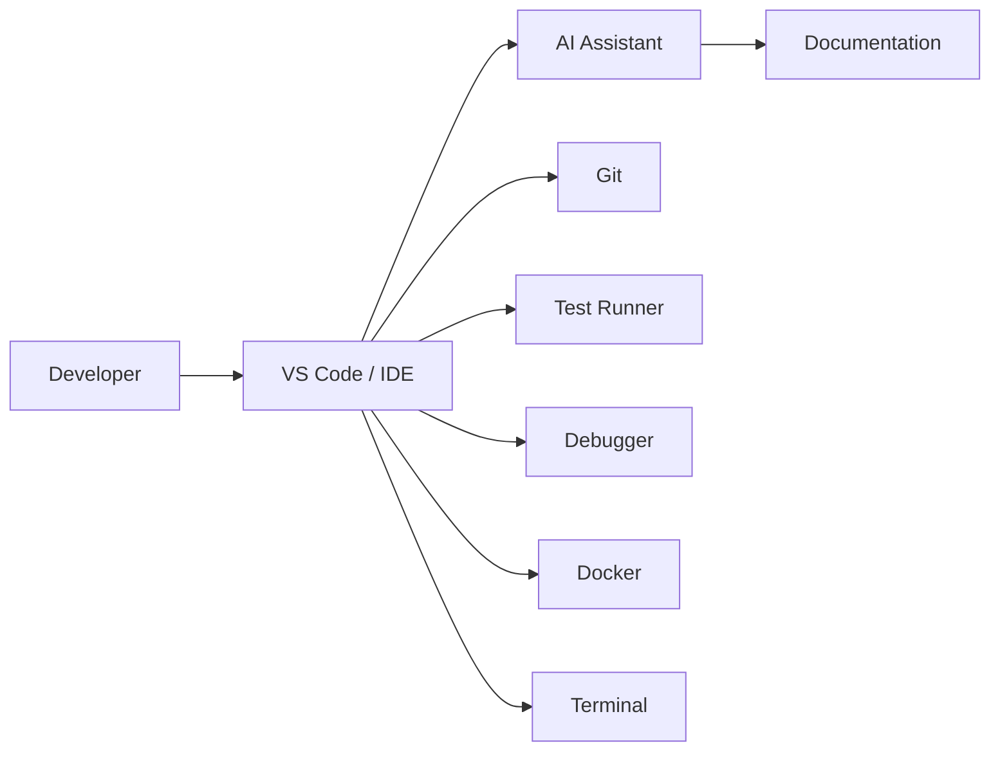

# Chapter 5 – Building Your AI-Assisted Development Environment

> *A productive AI workflow begins with a well-designed development environment, not with a powerful model.*

## Learning Objectives

After completing this chapter you will be able to:

- Design a professional AI-assisted development workstation.
- Select the right editor, AI tools, and supporting utilities.
- Configure a repeatable development environment.
- Apply security and productivity best practices.

---

# 5.1 Why Your Environment Matters

The best AI assistant cannot compensate for a poorly organized development environment.

Professional developers rely on an ecosystem of tools that work together:

- Source control
- Editors and IDEs
- AI assistants
- Build systems
- Test frameworks
- Debuggers
- Containers
- Documentation
- Automation

AI becomes another component in this ecosystem rather than the centre of it.

---

# 5.2 A Reference Architecture



Every tool should reduce context switching and increase feedback speed.

---

# 5.3 Essential Components

| Category | Examples |
|-----------|----------|
| Editor | Visual Studio Code |
| Version Control | Git |
| AI | ChatGPT, Codex, GitHub Copilot, Cursor |
| Containers | Docker |
| Terminal | Bash, Zsh, PowerShell |
| Testing | Language-specific frameworks |
| Formatting | Automated formatter |
| Static Analysis | Linters and security scanners |

Choose tools that integrate well rather than maximizing the number of extensions.

---

# 5.4 Recommended Project Layout

```text
project/
├── src/
├── tests/
├── docs/
├── scripts/
├── .github/
├── docker/
└── README.md
```

A consistent layout makes it easier for both humans and AI to understand your repository.

---

# 5.5 Security Considerations

Before enabling AI tools:

- Understand what data is shared.
- Exclude secrets from prompts.
- Use approved enterprise accounts where required.
- Review generated dependencies.
- Enable secret scanning in your repository.

Security is part of everyday development—not an afterthought.

---

# 5.6 Productivity Practices

Adopt these habits:

1. Keep commits small.
2. Run tests frequently.
3. Automate formatting.
4. Document architectural decisions.
5. Maintain project context for AI.
6. Review every generated change.

---

# Engineering Insight

> Faster development comes from reducing friction between tools, not from relying on a single tool.

---

# Common Mistakes

- Installing dozens of unused extensions.
- Mixing unrelated projects in one workspace.
- Ignoring editor warnings.
- Disabling automated formatting.
- Treating AI suggestions as final implementations.

---

# Hands-On Lab

Configure a new development workstation.

Verify that you can:

1. Clone a repository.
2. Build the project.
3. Run automated tests.
4. Commit changes with Git.
5. Use an AI assistant to explain an unfamiliar module.
6. Generate documentation for a new feature.

Document the setup so it can be reproduced by another developer.

---

# Chapter Summary

A professional AI-assisted environment combines modern development tools with disciplined engineering practices. The objective is not to maximize automation but to minimize friction, improve feedback, and support reliable software delivery.

---

# Review Questions

1. Why is tooling only one part of developer productivity?
2. What components belong in a modern AI-assisted workstation?
3. Why should repositories follow a consistent structure?
4. List five security practices for AI-assisted development.
5. How does automation improve software quality?

---

# Preview

Chapter 6 brings everything together as you build your first AI-assisted software project using the workflow established in the previous chapters.
