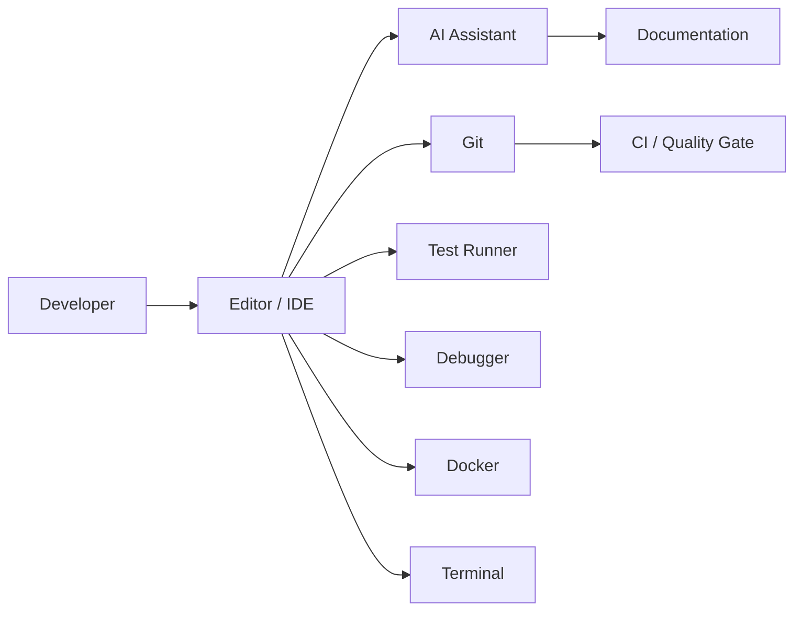

# Chapter 5 — Building Your AI-Assisted Development Environment

> *A productive AI workflow begins with a well-designed development environment, not with a powerful model.*

## Learning Objectives

By the end of this chapter, you will be able to:

- Design a professional AI-assisted development workstation from concrete, reusable configuration.
- Select an editor, AI tooling, and supporting utilities that integrate rather than compete.
- Configure a repeatable development environment using version-controlled config files.
- Apply security and productivity practices that hold up under real project pressure, not just in theory.

---

## 5.1 Why Your Environment Matters

The best AI assistant cannot compensate for a poorly organized development environment. A model that can write a perfect function is not much help if your linter isn't wired up to catch its mistakes, your tests aren't easy to run, or your repository structure is inconsistent enough that neither you nor the AI can reliably find the right file to edit.

Professional developers rely on an ecosystem of tools that work together: source control, an editor or IDE, AI assistants, build systems, test frameworks, debuggers, containers, documentation, and automation. AI becomes another component in this ecosystem — a capable one, but still one among many — rather than the center of it. This chapter is about building that ecosystem deliberately, with configuration you can check into a repository and reproduce on a new machine in minutes.

---

## 5.2 A Reference Architecture



Every tool in this diagram should reduce context switching and increase feedback speed. If a tool doesn't do one of those two things for you, it's worth questioning why it's in your workflow at all — tool sprawl is a real productivity cost, not a neutral one.

---

## 5.3 Essential Components

| Category | Examples | Notes |
|---|---|---|
| Editor | VS Code, JetBrains IDEs | Pick one you can configure deeply, not the one with the most extensions installed |
| Version control | Git | Non-negotiable; everything else in this table assumes it |
| AI assistant | Claude, GitHub Copilot, Cursor, local models via Ollama | Cloud and local aren't mutually exclusive — see Section 5.6 |
| Containers | Docker | For reproducible environments across machines |
| Terminal | Bash, Zsh | Whichever you can script comfortably in |
| Testing | pytest, Jest, etc. — language-specific | Must be a single command to run |
| Formatting | Black, Prettier, ruff format | Automated, not a matter of personal style debate |
| Static analysis | ruff, mypy, ESLint, bandit | Catches what review might miss, cheaply |

Choose tools that integrate well with each other rather than maximizing the number of extensions installed. A workstation with five well-configured tools that talk to each other beats one with thirty extensions that don't.

### A working VS Code configuration

Here's a concrete, checked-in `.vscode/settings.json` that ties formatting, linting, and testing together for a Python project — the kind of file that turns "my environment is set up" from a vague claim into something a teammate can literally clone and use:

```json
{
  "python.testing.pytestArgs": ["tests"],
  "python.testing.unittestEnabled": false,
  "python.testing.pytestEnabled": true,
  "editor.formatOnSave": true,
  "editor.defaultFormatter": "charliermarsh.ruff",
  "editor.codeActionsOnSave": {
    "source.fixAll.ruff": "explicit",
    "source.organizeImports.ruff": "explicit"
  },
  "[python]": {
    "editor.defaultFormatter": "charliermarsh.ruff"
  },
  "files.exclude": {
    "**/__pycache__": true,
    "**/.pytest_cache": true
  }
}
```

And the extensions that make it work, installable in one shot on a fresh machine:

```bash
code --install-extension charliermarsh.ruff
code --install-extension ms-python.python
code --install-extension eamodio.gitlens
code --install-extension anthropic.claude-code
```

---

## 5.4 Recommended Project Layout

```text
project/
├── src/
│   └── your_package/
├── tests/
├── docs/
├── scripts/
├── .github/
│   └── workflows/
├── docker/
├── .vscode/
│   └── settings.json
├── .env.example
├── .pre-commit-config.yaml
├── pyproject.toml
└── README.md
```

A consistent layout makes it easier for both humans and AI to understand your repository — when you paste "here's my project structure" into a prompt, a predictable layout means the model can make correct assumptions about where things live instead of guessing. This is also why `.env.example` (committed) versus `.env` (gitignored, never committed) is worth calling out explicitly: it documents the required configuration shape without leaking actual secrets, and it's a pattern AI assistants recognize and respect when generating code that reads environment variables.

---

## 5.5 Security Considerations

Before enabling AI tools on a real codebase:

- **Understand what data is shared.** Read your AI tool's data handling policy — does it train on your code, retain it, or send it to a third party? This differs meaningfully between consumer and enterprise/API tiers.
- **Exclude secrets from prompts.** Never paste `.env` contents, API keys, or credentials into a chat, even to "debug a connection issue" — describe the error instead.
- **Use approved enterprise accounts where required** by your organization's policy, rather than personal accounts for company code.
- **Review generated dependencies** before installing them — a hallucinated package name is a real supply-chain risk if it happens to exist on a public registry with malicious content (a known attack pattern called "slopsquatting").
- **Enable secret scanning** on your repository so an accidentally committed key gets caught even if a prompt-level habit fails.

That last point is worth doing as a concrete step, not just a bullet point. On GitHub:

```bash
gh api -X PATCH /repos/{owner}/{repo} \
  -f security_and_analysis[secret_scanning][status]=enabled \
  -f security_and_analysis[secret_scanning_push_protection][status]=enabled
```

Or via the UI: **Settings → Code security and analysis → Secret scanning → Enable**, and turn on **Push protection** alongside it so a secret is blocked *before* it lands in history, not just flagged after.

A `.gitignore` that actually excludes the common leak vectors is the first line of defense:

```gitignore
# Secrets and environment
.env
.env.local
*.pem
*.key
credentials.json

# AI tool caches that may retain context
.aider*
.continue/

# Standard excludes
__pycache__/
.pytest_cache/
node_modules/
```

Security here isn't an afterthought bolted onto AI-assisted development — it's part of the same everyday discipline as running tests before a merge.

---

## 5.6 A Local AI Stack on Raspberry Pi 5

Not every workflow needs a cloud API call. For local, offline-capable assistance — useful for cost control, privacy-sensitive contexts, or resource-constrained edge projects — Ollama on a Raspberry Pi 5 is a genuinely usable setup for smaller models.

```bash
# Install Ollama
curl -fsSL https://ollama.com/install.sh | sh

# Pull a model sized for Pi 5's memory (8GB or 16GB variants)
ollama pull hermes3:8b

# Verify it's running
ollama list
```

```text
NAME            ID              SIZE      MODIFIED
hermes3:8b      a1b2c3d4e5f6    4.7 GB    2 minutes ago
```

```bash
# Quick sanity check from the terminal
ollama run hermes3:8b "Explain what a context window is in one sentence."
```

For editor integration, the [Continue](https://continue.dev) VS Code extension can point at a local Ollama endpoint instead of a cloud API:

```json
// .continue/config.json
{
  "models": [
    {
      "title": "Hermes 3 (Local Pi5)",
      "provider": "ollama",
      "model": "hermes3:8b",
      "apiBase": "http://<pi5-ip>:11434"
    }
  ]
}
```

This is the same local stack referenced in Chapter 3's discussion of context windows, and it's the foundation for the scheduled, automated content-generation pipelines covered later in this book — local models are a genuinely different design point than cloud APIs, not a lesser version of the same thing, and Part 1 of this book treats both as legitimate parts of a professional toolkit depending on the constraint you're optimizing for.

---

## 5.7 Productivity Practices

Adopt these habits, and automate the ones that can be automated rather than relying on memory:

1. **Keep commits small** — one logical change per commit, as established in Chapter 4.
2. **Run tests frequently**, not just before a PR — a fast local test loop is what makes "frequently" realistic.
3. **Automate formatting** via a pre-commit hook so style never becomes a review discussion:

```yaml
# .pre-commit-config.yaml
repos:
  - repo: https://github.com/astral-sh/ruff-pre-commit
    rev: v0.6.9
    hooks:
      - id: ruff
        args: [--fix]
      - id: ruff-format
```

```bash
pip install pre-commit
pre-commit install
```

4. **Document architectural decisions** as you make them — a lightweight `docs/decisions/0001-use-sqlite-for-local-cache.md` per significant choice is enough; the format matters far less than the habit.
5. **Maintain project context for AI** — a short `CLAUDE.md` or `.cursorrules` file describing your conventions means every session starts with the right context instead of you re-explaining it each time.
6. **Review every generated change** — this is the one habit every other chapter in this book keeps returning to, because skipping it is where things go wrong.

---

## Engineering Insight

> Faster development comes from reducing friction between tools, not from relying on a single all-powerful tool.

---

## Common Mistakes

- Installing dozens of unused extensions that slow down the editor without adding real capability.
- Mixing unrelated projects in one workspace, confusing both the developer and any AI tool with repository-wide context access.
- Ignoring editor warnings and linter output because "it still runs."
- Disabling automated formatting to avoid a diff, then getting inconsistent style AI tools have to work around.
- Treating AI suggestions as final implementations rather than as a draft, regardless of how clean the environment producing them is.

---

## Hands-On Lab: Build a Reproducible Workstation

Set up a new development workstation (or a clean directory simulating one) with the following, verifying each step actually works rather than assuming the configuration is correct:

1. Clone a repository and confirm `git log` and `git status` work as expected.
2. Add the `.vscode/settings.json`, `.pre-commit-config.yaml`, and `.gitignore` from this chapter, adapted to your language of choice.
3. Build the project and run its test suite with a single command.
4. Make a small change, commit it, and confirm the pre-commit hook runs formatting automatically.
5. Use an AI assistant — cloud or local — to explain an unfamiliar module in the project, and check its explanation against the actual code.
6. Enable secret scanning and push protection on the repository, and confirm it blocks a deliberately-committed fake secret (e.g., a string that matches an API key pattern but isn't real).

Document the full setup in a `SETUP.md` so another developer — or a future you, on a new machine — can reproduce it from a cold start.

> **Screenshot placeholder:** Capture your VS Code window showing the Ruff formatter and linter active on a Python file, and a screenshot of GitHub's secret scanning alert firing on the deliberately-committed fake secret from step 6. Insert both here in the published version.

---

## Chapter Summary

A professional AI-assisted environment combines modern development tools — editor, version control, testing, linting, containers, and AI assistance, local or cloud — with disciplined engineering practices, all captured in version-controlled configuration rather than tribal knowledge. The objective is not to maximize automation for its own sake, but to minimize friction, tighten feedback loops, and support reliable software delivery.

---

## Review Questions

1. Why is tooling only one part of developer productivity, and what else determines it?
2. What components belong in a modern AI-assisted workstation, and how do they reduce friction specifically?
3. Why should repositories follow a consistent structure, and how does that structure benefit an AI assistant specifically, not just human readers?
4. List five security practices for AI-assisted development, and the specific risk each one addresses.
5. How does automating formatting and linting change what a human code reviewer needs to focus on?

---

## Preview

Chapter 6 brings everything together as you build your first complete AI-assisted software project — a command-line Notes Manager — applying the environment, workflow, and quality gates established throughout Part 1.
