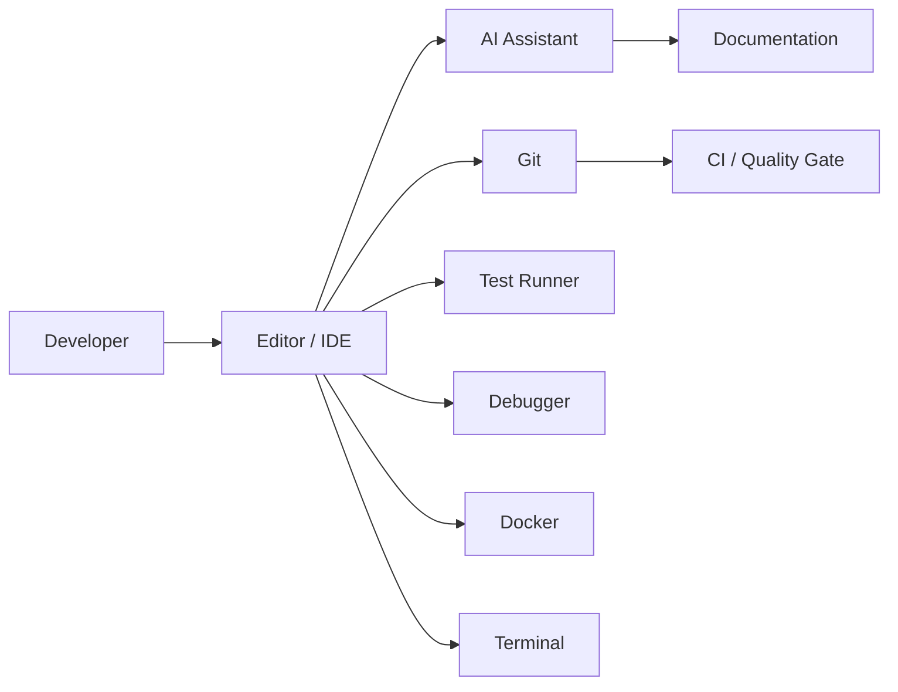

# Chapter 5 — Building Your AI-Assisted Development Environment

> *A productive AI workflow begins with a well-designed development environment, not with a powerful model.*

## Learning Objectives

By the end of this chapter, you will be able to:

- Design an AI-assisted development workstation from reusable configuration.
- Select an editor, AI tools and utilities that work together.
- Configure a repeatable development environment using version-controlled config files.
- Apply security and productivity practices that hold up under project pressure.

---

## 5.1 Why Your Environment Matters

The best AI assistant can't make up for a poorly organized environment. A model that writes a perfect function doesn't help much if your linter isn't set up to catch its mistakes, your tests are hard to run, or your repository is so inconsistent that neither you nor the AI can find the right file.

Developers rely on tools that work together: source control, an editor or IDE, AI assistants, build systems, test frameworks, debuggers, containers and automation. AI is one capable component among these, not the center. This chapter builds that set of tools with configuration you can check into a repository and reproduce on a new machine in minutes.

---

## 5.2 A Reference Architecture


```mermaid
flowchart LR
A[Developer]
A --> B[Editor / IDE]
B --> C[AI Assistant]
B --> D[Git]
B --> E[Test Runner]
B --> F[Debugger]
B --> G[Docker]
B --> H[Terminal]
C --> I[Documentation]
D --> J[CI / Quality Gate]
```

Every tool in this diagram should reduce context switching or speed up feedback. If a tool does neither, question why it's in your workflow: tool sprawl has a real cost.

---

## 5.3 Essential Components

| Category | Examples | Notes |
|---|---|---|
| Editor | VS Code, JetBrains IDEs | Pick one you can configure deeply, not the one with the most extensions installed |
| Version control | Git | Non-negotiable; everything else in this table assumes it |
| AI assistant | Claude, GitHub Copilot, Cursor, local models via Ollama | Cloud and local aren't mutually exclusive — see Section 5.6 |
| Containers | Docker | For reproducible environments across machines |
| Terminal | Bash, Zsh | Whichever you can script comfortably in |
| Testing | pytest, Jest, etc. — language-specific | Must be a single command to run |
| Formatting | Black, Prettier, ruff format | Automated, not a matter of personal style debate |
| Static analysis | ruff, mypy, ESLint, bandit | Catches what review might miss, cheaply |

Choose tools that work well together rather than installing as many extensions as possible. Five well-configured tools that integrate beat thirty extensions that don't.

### A working VS Code configuration

This checked-in `.vscode/settings.json` ties formatting, linting and testing together for a Python project. With it, "my environment is set up" becomes something a teammate can clone and use:

```json
{
  "python.testing.pytestArgs": ["tests"],
  "python.testing.unittestEnabled": false,
  "python.testing.pytestEnabled": true,
  "editor.formatOnSave": true,
  "editor.defaultFormatter": "charliermarsh.ruff",
  "editor.codeActionsOnSave": {
    "source.fixAll.ruff": "explicit",
    "source.organizeImports.ruff": "explicit"
  },
  "[python]": {
    "editor.defaultFormatter": "charliermarsh.ruff"
  },
  "files.exclude": {
    "**/__pycache__": true,
    "**/.pytest_cache": true
  }
}
```

The extensions it needs, installed in one go on a fresh machine:

```bash
code --install-extension charliermarsh.ruff
code --install-extension ms-python.python
code --install-extension eamodio.gitlens
code --install-extension anthropic.claude-code
```

---

## 5.4 Recommended Project Layout

```text
project/
├── src/
│   └── your_package/
├── tests/
├── docs/
├── scripts/
├── .github/
│   └── workflows/
├── docker/
├── .vscode/
│   └── settings.json
├── .env.example
├── .pre-commit-config.yaml
├── pyproject.toml
└── README.md
```

A consistent layout helps both humans and AI understand your repository. When you paste your project structure into a [prompt](../glossary.md#prompt), a predictable layout lets the model assume correctly where things live instead of guessing. Note `.env.example` (committed) versus `.env` (gitignored, never committed): the first documents the required configuration without leaking secrets, and AI assistants recognize the pattern when generating code that reads environment variables.

---

## 5.5 Security Considerations

Before enabling AI tools on a real codebase:

- **Understand what data is shared.** Does your AI tool train on your code, retain it, or send it to a third party? This often differs between consumer and business or API plans.
- **Keep secrets out of prompts.** Never paste `.env` contents, API keys or credentials into a chat, even to debug a connection; describe the error instead.
- **Use approved company accounts where required** by your organization's policy, rather than personal accounts for company code.
- **Review generated dependencies** before installing them. A hallucinated package name is a supply-chain risk if someone has published a malicious package under that name (an attack called "slopsquatting").
- **Enable secret scanning** so an accidentally committed key is caught even when habits fail.

On GitHub, you can enable secret scanning from the command line:

```bash
gh api -X PATCH /repos/{owner}/{repo} \
  -f security_and_analysis[secret_scanning][status]=enabled \
  -f security_and_analysis[secret_scanning_push_protection][status]=enabled
```

Or in the UI: open the repository's **Settings**, find the code security page (currently **Advanced Security**; GitHub renames these menus from time to time), enable **Secret Protection**, and turn on **Push protection** so a secret is blocked *before* it lands in history, not just flagged afterward.

Check availability before you rely on this. Secret scanning and push protection are free for public repositories. For private repositories, they need a paid add-on (GitHub Secret Protection, part of what used to be called GitHub Advanced Security) on an organization plan. If you can't enable them, a local pre-commit secret scanner is a reasonable substitute.

Push protection matches secrets against patterns for known providers, such as cloud keys and tokens from popular services. A made-up string won't be blocked, and neither will an unsupported provider's key. It reduces risk; it doesn't replace keeping secrets out of your code.

A `.gitignore` that excludes the common leak vectors is the first line of defense:

```gitignore
# Secrets and environment
.env
.env.local
*.pem
*.key
credentials.json

# AI tool caches that may retain context
.aider*
.continue/

# Standard excludes
__pycache__/
.pytest_cache/
node_modules/
```

---

## 5.6 A Local AI Stack on Raspberry Pi 5

Not every workflow needs a cloud API call. For local, offline assistance — useful for cost control, privacy-sensitive work, or edge projects — Ollama on a Raspberry Pi 5 is a usable setup for smaller models.

```bash
# Install Ollama
curl -fsSL https://ollama.com/install.sh | sh

# Pull a model sized for Pi 5's memory (8GB or 16GB variants)
ollama pull hermes3:8b

# Verify it's running
ollama list
```

```text
NAME          ID              SIZE      MODIFIED
hermes3:8b    4f6b83f30b62    4.7 GB    3 seconds ago
```

```bash
# Quick sanity check from the terminal
ollama run hermes3:8b "Explain what a context window is in one sentence."
```

```text
A context window, in the context of natural language processing, refers to
a fixed number of words surrounding a target word or token that is used to
provide additional information for understanding and analyzing the text.
```

(Real output on a Raspberry Pi 5 with 8 GB of RAM; the first run took about 45 seconds, most of it loading the model.) The answer is fluent, but it describes an older meaning of "context window" from word-embedding research, not the token budget of an [LLM](../glossary.md#llm) from Chapter 3. Read even a one-sentence sanity check critically. Small local models make this kind of mistake more often than large cloud models; that's part of the trade-off.

For editor integration, the [Continue](https://continue.dev) VS Code extension can point at a local Ollama endpoint instead of a cloud API:

```yaml
# ~/.continue/config.yaml
name: Local Pi 5
version: 0.0.1
schema: v1

models:
  - name: Hermes 3 (Local Pi 5)
    provider: ollama
    model: hermes3:8b
    apiBase: http://<pi5-ip>:11434
```

Continue's configuration format has changed over time (older guides use a `config.json` file), so check [Continue's Ollama documentation](https://docs.continue.dev/customize/model-providers/top-level/ollama) for the current format before copying this. If Ollama runs on the same machine as your editor, you can leave out `apiBase`. If it runs on another machine, as here, Ollama has to be started with `OLLAMA_HOST=0.0.0.0:11434` so it accepts connections from the network — only do that on a network you trust.

This is the same local stack used in Chapter 3's discussion of context windows. Local models are a different trade-off from cloud APIs, not a lesser version of them. Choose based on the constraint that matters most: cost, privacy, capability or speed.

---

## 5.7 Productivity Practices

Adopt these habits, and automate the ones you can instead of relying on memory:

1. **Keep commits small** — one logical change per commit, as established in Chapter 4.
2. **Run tests frequently**, not just before a pull request. A fast local test loop makes this realistic.
3. **Automate formatting** with a pre-commit hook so style never comes up in review:

```yaml
# .pre-commit-config.yaml
repos:
  - repo: https://github.com/astral-sh/ruff-pre-commit
    rev: v0.16.10  # run `pre-commit autoupdate` to move to the latest release
    hooks:
      - id: ruff-check
        args: [--fix]
      - id: ruff-format
```

```bash
pip install pre-commit
pre-commit install
```

4. **Document architectural decisions** as you make them. A short `docs/decisions/0001-use-sqlite-for-local-cache.md` per significant choice is enough; the habit matters more than the format.
5. **Maintain project context for AI.** A short context file such as `CLAUDE.md` or `AGENTS.md` describing your conventions means every session starts with the right context. Chapter 4, Section 4.5 explains what to put in one.
6. **Review every generated change** ([Chapter 1, Section 1.8](01-introduction.md#18-the-workflow-used-throughout-this-book), step 7).

---

## Engineering Insight

> Faster development comes from reducing friction between tools, not from relying on a single all-powerful tool.

---

## Common Mistakes

- Installing dozens of unused extensions that slow the editor down without adding capability.
- Mixing unrelated projects in one workspace, which confuses both you and any AI tool that reads the whole repository.
- Ignoring editor warnings and linter output because "it still runs."
- Disabling automated formatting to avoid a diff, leaving inconsistent style that AI tools then copy.
- Treating AI suggestions as final rather than as drafts, however clean the environment.

---

## Hands-On Lab: Build a Reproducible Workstation

Set up a new workstation (or a clean directory standing in for one) as follows, checking that each step works rather than assuming it does:

1. Clone a repository and confirm `git log` and `git status` work as expected.
2. Add the `.vscode/settings.json`, `.pre-commit-config.yaml`, and `.gitignore` from this chapter, adapted to your language of choice.
3. Build the project and run its test suite with a single command.
4. Make a small change, commit it, and confirm the pre-commit hook runs formatting automatically.
5. Use an AI assistant — cloud or local — to explain an unfamiliar module in the project, and check its explanation against the actual code.
6. Enable secret scanning and push protection (on a public test repository if your private ones don't have Secret Protection; see Section 5.5). Try to push a commit containing a fake secret and confirm the push is blocked. The fake value has to match a supported provider's token format, since a made-up string won't trigger it. Never use a real credential for this test.

Document the full setup in a `SETUP.md` so another developer, or you on a new machine, can reproduce it from scratch.

---

## Chapter Summary

A good AI-assisted environment combines development tools — editor, version control, testing, linting, containers and AI assistance, local or cloud — with disciplined practices, all captured in version-controlled configuration rather than in people's heads. The aim isn't maximum automation; it's less friction, tighter feedback loops and reliable delivery.

---

## Review Questions

1. Why is tooling only one part of developer productivity, and what else determines it?
2. What components belong in a modern AI-assisted workstation, and how do they reduce friction specifically?
3. Why should repositories follow a consistent structure, and how does that structure benefit an AI assistant specifically, not just human readers?
4. List five security practices for AI-assisted development, and the specific risk each one addresses.
5. How does automating formatting and linting change what a human code reviewer needs to focus on?

---

## Further Reading

- GitHub Docs, [Secret scanning](https://docs.github.com/en/code-security/concepts/secret-security/secret-scanning) and [Push protection](https://docs.github.com/en/code-security/concepts/secret-security/push-protection). What they detect, and which plans include them.
- [Continue: Ollama provider](https://docs.continue.dev/customize/model-providers/top-level/ollama). The current configuration format for Section 5.6.
- [pre-commit](https://pre-commit.com/). Installing and configuring the hooks in Section 5.7.
- Visual Studio Code, [Python quick start](https://code.visualstudio.com/docs/python/python-quick-start). Setting up VS Code for Python.

---

## Next Chapter

Chapter 6 brings everything together: you build a complete project, a command-line Notes Manager, using the environment, workflow and quality gates from Part 1.
