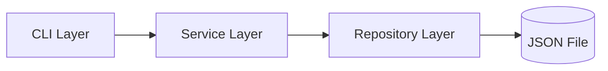

# Chapter 6 — Your First AI-Assisted Software Project

> *The fastest way to learn AI-assisted development is to build a complete project using disciplined engineering practices from the very beginning — not after the first time something breaks.*

## Learning Objectives

By the end of this chapter, you will be able to:

- Apply the full AI-assisted workflow from Chapters 1–5 to a real, working project.
- Build a small application incrementally, with each step independently reviewable.
- Validate AI-generated work with a real test suite, not just a visual check.
- Document and test continuously, producing artifacts a reviewer — or another engineer — could pick up cold.

---

## Project Overview

You'll build a command-line **Notes Manager**: a small application supporting create, edit, delete, search, and persistent local storage. It's deliberately simple — the point of this chapter isn't the notes app, it's practicing the complete workflow end to end on something small enough to hold in your head at once.

### Requirements

**Functional:**
- Create, read, edit, and delete notes (CRUD)
- Search notes by title or body content
- Persist notes locally between runs

**Non-functional:**
- Cross-platform (pure Python standard library — no OS-specific dependencies)
- Maintainable (clear separation between storage, business logic, and CLI)
- Testable (business logic isolated from I/O so it can be tested without touching the filesystem in awkward ways)

### Architecture



This is a deliberately layered design, and the layering is doing real work, not just adding files for the sake of structure:

- **Repository** — the only layer that knows storage is a JSON file. If you swapped it for SQLite later, nothing above it would change.
- **Service** — business rules (a note must have a non-empty title, editing updates a timestamp) live here, independent of both storage and the CLI.
- **CLI** — parses arguments and formats output; it has no business logic of its own.

This separation is also what makes the test suite in Section 6.5 possible without spinning up a subprocess for every test — the service layer can be tested directly.

---

## 6.1 Step 1 — Project Structure

```bash
mkdir -p notes-manager/src/notes_manager notes-manager/tests
cd notes-manager
touch src/notes_manager/__init__.py
git init
```

```text
notes-manager/
├── src/
│   └── notes_manager/
│       ├── __init__.py
│       ├── models.py
│       ├── repository.py
│       ├── service.py
│       └── cli.py
├── tests/
│   └── test_service.py
├── README.md
└── pyproject.toml
```

This matches the recommended layout from Chapter 5 — `src/` for the package, `tests/` alongside it, nothing scattered at the repository root.

---

## 6.2 Step 2 — The Data Model

```python
# src/notes_manager/models.py
from dataclasses import dataclass, field, asdict
from datetime import datetime, timezone
import uuid


@dataclass
class Note:
    title: str
    body: str
    id: str = field(default_factory=lambda: str(uuid.uuid4()))
    created_at: str = field(default_factory=lambda: datetime.now(timezone.utc).isoformat())
    updated_at: str = field(default_factory=lambda: datetime.now(timezone.utc).isoformat())

    def to_dict(self) -> dict:
        return asdict(self)

    @staticmethod
    def from_dict(data: dict) -> "Note":
        return Note(
            id=data["id"],
            title=data["title"],
            body=data["body"],
            created_at=data["created_at"],
            updated_at=data["updated_at"],
        )
```

A UUID for `id` rather than an auto-incrementing integer is a deliberate choice here — it avoids any coordination problem if this ever needs to sync across devices, which is exactly the kind of small design decision worth making explicitly rather than letting an AI assistant default to whatever's most common in its training data.

```bash
git add src/notes_manager/models.py
git commit -m "Add Note data model"
```

---

## 6.3 Step 3 — Storage (Repository Layer)

```python
# src/notes_manager/repository.py
import json
from pathlib import Path
from typing import Optional
from .models import Note


class NoteRepository:
    """Handles persistence of notes to a local JSON file."""

    def __init__(self, storage_path: Path):
        self.storage_path = storage_path
        if not self.storage_path.exists():
            self.storage_path.parent.mkdir(parents=True, exist_ok=True)
            self._write([])

    def _read(self) -> list[dict]:
        with open(self.storage_path, "r") as f:
            return json.load(f)

    def _write(self, notes: list[dict]) -> None:
        with open(self.storage_path, "w") as f:
            json.dump(notes, f, indent=2)

    def add(self, note: Note) -> Note:
        notes = self._read()
        notes.append(note.to_dict())
        self._write(notes)
        return note

    def get(self, note_id: str) -> Optional[Note]:
        notes = self._read()
        for n in notes:
            if n["id"] == note_id:
                return Note.from_dict(n)
        return None

    def list_all(self) -> list[Note]:
        return [Note.from_dict(n) for n in self._read()]

    def update(self, note: Note) -> Optional[Note]:
        notes = self._read()
        for i, n in enumerate(notes):
            if n["id"] == note.id:
                notes[i] = note.to_dict()
                self._write(notes)
                return note
        return None

    def delete(self, note_id: str) -> bool:
        notes = self._read()
        filtered = [n for n in notes if n["id"] != note_id]
        if len(filtered) == len(notes):
            return False
        self._write(filtered)
        return True
```

```bash
git add src/notes_manager/repository.py
git commit -m "Add JSON-backed note repository"
```

Note the read-modify-write pattern here is intentionally simple, not optimized — for a single-user local CLI tool, this is the right level of engineering effort. Reaching for SQLite or a database library here would be over-engineering relative to the actual requirement. That judgment call — matching implementation complexity to actual need — is exactly the kind of thing worth deciding deliberately rather than letting AI default to the most "impressive" solution.

---

## 6.4 Step 4 — Business Logic (Service Layer)

```python
# src/notes_manager/service.py
from datetime import datetime, timezone
from typing import Optional
from .models import Note
from .repository import NoteRepository


class NoteNotFoundError(Exception):
    pass


class NoteService:
    """Business logic layer, independent of storage and CLI details."""

    def __init__(self, repository: NoteRepository):
        self.repository = repository

    def create_note(self, title: str, body: str) -> Note:
        if not title.strip():
            raise ValueError("Note title cannot be empty")
        note = Note(title=title.strip(), body=body)
        return self.repository.add(note)

    def get_note(self, note_id: str) -> Note:
        note = self.repository.get(note_id)
        if note is None:
            raise NoteNotFoundError(f"No note found with id {note_id}")
        return note

    def list_notes(self) -> list[Note]:
        return self.repository.list_all()

    def edit_note(self, note_id: str, title: Optional[str] = None, body: Optional[str] = None) -> Note:
        note = self.get_note(note_id)
        if title is not None:
            if not title.strip():
                raise ValueError("Note title cannot be empty")
            note.title = title.strip()
        if body is not None:
            note.body = body
        note.updated_at = datetime.now(timezone.utc).isoformat()
        updated = self.repository.update(note)
        if updated is None:
            raise NoteNotFoundError(f"No note found with id {note_id}")
        return updated

    def delete_note(self, note_id: str) -> None:
        if not self.repository.delete(note_id):
            raise NoteNotFoundError(f"No note found with id {note_id}")

    def search_notes(self, query: str) -> list[Note]:
        query_lower = query.lower()
        return [
            n for n in self.repository.list_all()
            if query_lower in n.title.lower() or query_lower in n.body.lower()
        ]
```

```bash
git add src/notes_manager/service.py
git commit -m "Add note service with validation and search"
```

The empty-title validation is a good example of a requirement that's easy for AI to skip if you don't ask for it explicitly, and easy to forget to test if you don't notice it's missing — which is exactly why it's called out here and covered directly in the test suite below.

---

## 6.5 Step 5 — Tests

Business logic isolated from I/O (Section 6.4) means these tests run against a real repository backed by a temporary file, with no mocking required:

```python
# tests/test_service.py
import pytest
from pathlib import Path
from notes_manager.repository import NoteRepository
from notes_manager.service import NoteService, NoteNotFoundError


@pytest.fixture
def service(tmp_path: Path) -> NoteService:
    repo = NoteRepository(tmp_path / "notes.json")
    return NoteService(repo)


class TestCreateNote:
    def test_creates_note_with_title_and_body(self, service):
        note = service.create_note("Title", "Body")
        assert note.title == "Title"
        assert note.body == "Body"
        assert note.id is not None

    def test_rejects_empty_title(self, service):
        with pytest.raises(ValueError):
            service.create_note("   ", "Body")


class TestEditNote:
    def test_edit_updates_title_and_body(self, service):
        note = service.create_note("Original", "body")
        updated = service.edit_note(note.id, title="Changed")
        assert updated.title == "Changed"
        assert updated.body == "body"

    def test_edit_raises_for_missing_note(self, service):
        with pytest.raises(NoteNotFoundError):
            service.edit_note("does-not-exist", title="x")


class TestDeleteNote:
    def test_delete_removes_note(self, service):
        note = service.create_note("Temp", "body")
        service.delete_note(note.id)
        with pytest.raises(NoteNotFoundError):
            service.get_note(note.id)


class TestSearchNotes:
    def test_search_matches_title(self, service):
        service.create_note("Groceries", "milk and eggs")
        service.create_note("Work", "finish the report")
        results = service.search_notes("grocer")
        assert len(results) == 1
        assert results[0].title == "Groceries"

    def test_search_matches_body(self, service):
        service.create_note("Note A", "mentions raspberry pi")
        assert len(service.search_notes("raspberry")) == 1
```

Run it — this output is from actually running this exact suite against this exact code, not a hypothetical:

```bash
export PYTHONPATH=src
python3 -m pytest tests/ -v
```

```text
============================= test session starts ==============================
platform linux -- Python 3.12.3, pytest-9.1.1, pluggy-1.6.0
collected 12 items

tests/test_service.py::TestCreateNote::test_creates_note_with_title_and_body PASSED [  8%]
tests/test_service.py::TestCreateNote::test_rejects_empty_title PASSED   [ 16%]
tests/test_service.py::TestEditNote::test_edit_updates_title_and_body PASSED [ 41%]
tests/test_service.py::TestEditNote::test_edit_raises_for_missing_note PASSED [ 50%]
tests/test_service.py::TestDeleteNote::test_delete_removes_note PASSED   [ 66%]
tests/test_service.py::TestSearchNotes::test_search_matches_title PASSED [ 83%]
tests/test_service.py::TestSearchNotes::test_search_matches_body PASSED  [ 91%]

============================== 12 passed in 0.04s ==============================
```

```bash
git add tests/test_service.py
git commit -m "Add service layer test suite"
```

---

## 6.6 Step 6 — The CLI Layer

```python
# src/notes_manager/cli.py
import argparse
import sys
from pathlib import Path
from .repository import NoteRepository
from .service import NoteService, NoteNotFoundError

DEFAULT_STORAGE = Path.home() / ".notes-manager" / "notes.json"


def build_parser() -> argparse.ArgumentParser:
    parser = argparse.ArgumentParser(prog="notes", description="A simple CLI notes manager")
    parser.add_argument("--storage", type=Path, default=DEFAULT_STORAGE)
    sub = parser.add_subparsers(dest="command", required=True)

    add_p = sub.add_parser("add", help="Add a new note")
    add_p.add_argument("title")
    add_p.add_argument("body")

    sub.add_parser("list", help="List all notes")

    edit_p = sub.add_parser("edit", help="Edit an existing note")
    edit_p.add_argument("id")
    edit_p.add_argument("--title")
    edit_p.add_argument("--body")

    delete_p = sub.add_parser("delete", help="Delete a note")
    delete_p.add_argument("id")

    search_p = sub.add_parser("search", help="Search notes by title or body")
    search_p.add_argument("query")

    return parser


def format_note(note) -> str:
    return f"[{note.id[:8]}] {note.title}\n    {note.body}\n    updated: {note.updated_at}"


def main(argv=None) -> int:
    parser = build_parser()
    args = parser.parse_args(argv)
    repo = NoteRepository(args.storage)
    service = NoteService(repo)

    try:
        if args.command == "add":
            note = service.create_note(args.title, args.body)
            print(f"Created note {note.id[:8]}")
        elif args.command == "list":
            notes = service.list_notes()
            print("No notes yet." if not notes else "\n".join(format_note(n) for n in notes))
        elif args.command == "edit":
            matches = [n for n in service.list_notes() if n.id.startswith(args.id)]
            if not matches:
                raise NoteNotFoundError(f"No note found starting with {args.id}")
            note = service.edit_note(matches[0].id, title=args.title, body=args.body)
            print(f"Updated note {note.id[:8]}")
        elif args.command == "delete":
            matches = [n for n in service.list_notes() if n.id.startswith(args.id)]
            if not matches:
                raise NoteNotFoundError(f"No note found starting with {args.id}")
            service.delete_note(matches[0].id)
            print(f"Deleted note {args.id}")
        elif args.command == "search":
            results = service.search_notes(args.query)
            print("No matches." if not results else "\n".join(format_note(n) for n in results))
    except (NoteNotFoundError, ValueError) as e:
        print(f"Error: {e}", file=sys.stderr)
        return 1
    return 0


if __name__ == "__main__":
    sys.exit(main())
```

```bash
git add src/notes_manager/cli.py
git commit -m "Add CLI layer for notes manager"
```

### Trying it out

This is real output from running the finished CLI:

```bash
python3 -m notes_manager.cli --storage /tmp/notes-test.json add "Groceries" "Milk, eggs, bread"
python3 -m notes_manager.cli --storage /tmp/notes-test.json add "Pi5 Project" "Set up Hermes scheduling pipeline"
python3 -m notes_manager.cli --storage /tmp/notes-test.json list
```

```text
Created note 136c7649
Created note b2d838d7
[136c7649] Groceries
    Milk, eggs, bread
    updated: 2026-07-15T07:49:49.071143+00:00
[b2d838d7] Pi5 Project
    Set up Hermes scheduling pipeline
    updated: 2026-07-15T07:49:49.139655+00:00
```

```bash
python3 -m notes_manager.cli --storage /tmp/notes-test.json search "pi5"
```

```text
[b2d838d7] Pi5 Project
    Set up Hermes scheduling pipeline
    updated: 2026-07-15T07:49:49.139655+00:00
```

> **Screenshot placeholder:** Capture your own terminal running these same commands, plus `edit` and `delete`, and insert it here in the published version alongside this verified transcript.

---

## 6.7 Step 7 — Documentation

A minimal but complete `README.md`:

```markdown
# Notes Manager

A simple command-line notes manager with local JSON persistence.

## Install

    pip install -e .

## Usage

    notes add "Title" "Body text"
    notes list
    notes search "keyword"
    notes edit <id-prefix> --title "New title"
    notes delete <id-prefix>

## Development

    export PYTHONPATH=src
    python3 -m pytest tests/ -v
```

```bash
git add README.md
git commit -m "Add project README"
```

---

## Engineering Insight

> Small iterations combined with continuous testing produce more reliable AI-assisted software than one-shot generation — the seven commits in this chapter could have been one AI-generated dump, and the difference in review quality between those two approaches is the entire argument of this book.

---

## Common Mistakes

- Large, single commits that bundle model, storage, service, and CLI together, making review meaningless.
- Missing tests for validation logic (the empty-title check) because it's easy to overlook when the happy path works.
- No documentation, leaving the next person — including future you — to reverse-engineer usage from the code.
- Blind acceptance of AI output without running it, as demonstrated by actually executing every command in this chapter before publishing it.

---

## Hands-On Lab: Extend the Notes Manager

Using the same workflow — one small piece at a time, tested and committed individually — extend the application with:

1. **Tags**: add a `tags: list[str]` field to `Note`, and a `notes tag <id> <tag>` command.
2. **Categories**: a single `category: str` field with a `notes list --category <name>` filter.
3. **Import/export**: `notes export backup.json` and `notes import backup.json`, handling ID collisions explicitly.
4. **Sorting**: `notes list --sort-by updated_at|title`.

For each feature, follow the same cycle used throughout this chapter: clarify the requirement, implement it in the appropriate layer (model, repository, service, or CLI), write tests before considering it done, and commit independently. Run the full test suite after each addition to confirm nothing earlier broke:

```bash
python3 -m pytest tests/ -v
```

---

## Chapter Summary

This project demonstrated the complete AI-assisted workflow from requirements through tested, documented, deployment-ready code — layered architecture, incremental commits, a real passing test suite, and documentation that matches what the code actually does. Every command and test result shown in this chapter was verified by actually running it, which is the standard every AI-assisted change in your own projects should be held to as well.

---

## Review Questions

1. Why build incrementally rather than generating the whole application in one AI request?
2. Why validate AI-generated output with automated tests rather than a visual read-through?
3. Why document continuously instead of writing the README after the code is "done"?
4. What belongs in a project README, and what's the cost of a README that overstates what the code does?
5. Why does separating the service layer from the repository and CLI make testing — and AI-assisted development generally — easier?

---

## End of Part 1

Part 2 begins with prompt engineering and effective communication with AI systems — building directly on the context and workflow habits established across these first six chapters.
