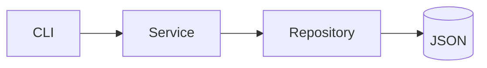

# Chapter 6 – Your First AI-Assisted Software Project

> *The fastest way to learn AI-assisted development is to build a complete project using disciplined engineering practices from the very beginning.*

## Learning Objectives

- Apply the AI-assisted workflow.
- Build a small project incrementally.
- Validate AI-generated work.
- Document and test continuously.

## Project Overview

Build a command-line Notes Manager supporting create, edit, delete, search and persistent storage.

## Requirements

Functional:
- CRUD operations
- Search
- Local persistence

Non-functional:
- Cross-platform
- Maintainable
- Testable

## Architecture

## Incremental Workflow

1. Create project.
2. Build model.
3. Add storage.
4. Implement commands.
5. Test.
6. Refactor.
7. Document.

## Testing

Create unit, persistence, regression and error-handling tests for every feature.

## Documentation

Maintain a README, architecture notes, usage guide and changelog throughout development.

## Engineering Insight

> Small iterations combined with continuous testing produce more reliable AI-assisted software than one-shot generation.

## Common Mistakes

- Large commits
- Missing tests
- No documentation
- Blind acceptance of AI output

## Hands-On Lab

Extend the application with tags, categories, import/export and sorting.

## Chapter Summary

This project demonstrates the complete AI-assisted workflow from requirements to deployment-ready documentation while keeping the engineer responsible for every technical decision.

## Review Questions

1. Why build incrementally?
2. Why validate AI output?
3. Why document continuously?
4. What belongs in a project README?
5. Why are tests essential?

## End of Part 1

Part 2 begins with prompt engineering and effective communication with AI systems.
