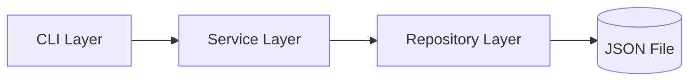

# Chapter 6 — Your First AI-Assisted Software Project

> *The fastest way to learn AI-assisted development is to build a complete project using disciplined engineering practices from the very beginning — not after the first time something breaks.*

## Learning Objectives

By the end of this chapter, you will be able to:

- Apply the workflow from Chapters 1–5 to a small, complete project.
- Split a project into steps small enough to review and commit one at a time.
- Decide what to accept, change or reject in AI output, and record why.
- Catch mistakes, the AI's and your own, with tests and by running the code.
- Keep a development journal of an AI-assisted session.

---

## Project Overview

You'll build a command-line **Notes Manager**: a small application that can create, edit, delete and search notes, and keeps them in a local file. It's deliberately simple. The point of this chapter isn't the notes app. It's practicing the complete workflow on something small enough to hold in your head at once.

### Requirements

**Functional:**

- Create, read, edit, and delete notes (CRUD)
- Search notes by title or body content
- Persist notes locally between runs

**Non-functional:**

- Cross-platform (pure Python standard library — no OS-specific dependencies)
- Maintainable (clear separation between storage, business logic, and CLI)
- Testable (business logic isolated from I/O so it can be tested without touching the filesystem in awkward ways)

### Architecture


```mermaid
flowchart LR
CLI[CLI Layer] --> Service[Service Layer]
Service --> Repository[Repository Layer]
Repository --> Storage[(JSON File)]
```

Each layer has one job:

- **Repository** — the only layer that knows storage is a JSON file. If you swapped it for SQLite later, nothing above it would change.
- **Service** — business rules (a note must have a non-empty title, editing updates a timestamp) live here, independent of both storage and the CLI.
- **CLI** — parses arguments and formats output; it has no business logic of its own.

This separation is also what makes the test suite in Section 6.5 possible without starting a separate process for every test: the service layer can be tested directly.

### How this chapter was made

This chapter records a real AI session, not code that was tidied up afterwards. On 2026-10-03 the project was built step by step with an [agentic](../glossary.md#agent) tool (Claude Code, using the model `claude-opus-5-5`). Any of the tools from Chapter 0 would work. Your tool, and even the same tool on another day, will give different answers to the same [prompts](../glossary.md#prompt), because models sample their output (Chapter 3, Section 3.2).

The AI was allowed to read and edit files but not to run commands, one of the permission choices from Chapter 4, Section 4.5. So every test run and every commit in this chapter was done by hand. Each step followed the same loop:

1. Send one prompt for one small piece of the project.
2. Read the diff and the AI's summary, including the caveats at the end.
3. Run the tests.
4. Decide what to accept, change or reject, and commit the reviewed version.
5. Start the next prompt by telling the AI what you changed, so it doesn't keep working from its own version.

Each step below shows the prompt, a short extract of what came back, and the review decisions. Prompts are quoted word for word, with line breaks added to fit the page, and quotes from replies are exact. The [full transcript](https://github.com/ashwinkrpi/ai-assisted-development-book/blob/main/transcripts/ch06-notes-manager-session.md) has every reply and every file the AI wrote.

Each code listing is the final, reviewed version of the file, the same as in the book's [`examples/ch06-notes-manager`](https://github.com/ashwinkrpi/ai-assisted-development-book/tree/main/examples/ch06-notes-manager) folder. Where a later step changed a file, that step shows the change. The AI's versions were often longer than the listings. Some of that extra code was good. The book keeps the shorter versions so the listings stay readable, and the review notes say what was left out.

---

## 6.1 Step 1 — Project Structure

This step was done by hand. There's nothing here for an AI to decide, and a fixed starting point makes the later prompts simpler.

```bash
mkdir -p notes-manager/src/notes_manager notes-manager/tests
cd notes-manager
touch src/notes_manager/__init__.py
git init
```

```text
notes-manager/
├── src/
│   └── notes_manager/
│       ├── __init__.py
│       ├── models.py
│       ├── repository.py
│       ├── service.py
│       └── cli.py
├── tests/
│   ├── test_service.py
│   └── test_cli.py
├── README.md
└── pyproject.toml
```

This matches the recommended layout from Chapter 5 — `src/` for the package, `tests/` alongside it, nothing scattered at the repository root.

`pyproject.toml` describes the project to Python's packaging tools. It names the package, declares `pytest` as a development dependency, and creates a `notes` command that runs the `main` function in `cli.py`:

```toml
# pyproject.toml
[build-system]
requires = ["setuptools>=61"]
build-backend = "setuptools.build_meta"

[project]
name = "notes-manager"
version = "0.1.0"
description = "A simple command-line notes manager with local JSON persistence"
requires-python = ">=3.10"

[project.optional-dependencies]
dev = ["pytest"]

[project.scripts]
notes = "notes_manager.cli:main"

[tool.pytest.ini_options]
pythonpath = ["src"]
testpaths = ["tests"]
```

The `pythonpath` setting lets pytest import the package from `src/`, so the tests run without any extra setup.

Install the project into a *virtual environment*, a private folder of Python packages for this project only, so nothing you install here affects other projects:

```bash
python3 -m venv .venv
source .venv/bin/activate      # on Windows: .venv\Scripts\activate
pip install -e ".[dev]"
```

The `-e` flag makes the install *editable*: the `notes` command runs your source files directly, so changes take effect without reinstalling. The `notes` command won't work until you write `cli.py` in Step 6.

The install also creates a `src/notes_manager.egg-info/` folder of package metadata, and running Python and pytest creates `__pycache__/` and `.pytest_cache/` folders. All of these are generated, so keep them out of git:

```bash
printf ".venv/\n*.egg-info/\n__pycache__/\n.pytest_cache/\n" > .gitignore
git add pyproject.toml .gitignore src/notes_manager/__init__.py
git commit -m "Add project skeleton and pyproject.toml"
```

---

## 6.2 Step 2 — The Data Model

The first prompt gives the context (what the project is and what already exists), the goal for this step only, and a constraint on scope. It also asks for assumptions, as Chapter 0, Section 0.5 suggests:

```
I'm building a small command-line notes manager in Python, using only the
standard library. The project skeleton is already in place: see
pyproject.toml and src/notes_manager/. The finished app will have three
layers: a repository that stores notes in a local JSON file, a service layer
with the business rules, and an argparse CLI on top.

For this step, write only src/notes_manager/models.py: a Note dataclass with
an id, a title, a body, and created and updated timestamps, plus methods to
convert a Note to and from a dict so it can be saved as JSON.

Don't create or change any other files. Before you write the code, list any
assumptions you're making.
```

**What came back.** A 66-line `models.py`. Its timestamps were `datetime` objects, converted to text only when saved, and new notes were made with a `Note.new()` class method:

```python
    id: str
    title: str
    body: str
    created_at: datetime
    updated_at: datetime

    @classmethod
    def new(cls, title: str, body: str) -> Note:
        """Create a new note with a fresh id and matching timestamps."""
```

It did **not** list its assumptions first. It wrote the file, then summarized what it had done. Tools don't always follow every instruction in a prompt, so check that each one was followed. If the assumptions matter, ask for them in a separate prompt, before any code.

**Review:**

- **Accepted:** a random UUID for the ID. The prompt didn't say what kind of ID to use, so this was the AI's choice, and it's a good one: unlike a counter, it needs no coordination if notes are ever synced between devices. Check choices like this deliberately rather than accepting whatever the AI defaults to.
- **Changed:** timestamps became ISO 8601 strings with default values, and `Note.new()` was dropped. Nothing in this app does date arithmetic, so strings keep the JSON conversion to one line (`asdict`), and `Note(title, body)` works on its own. That makes the tests in Step 5 shorter.

```python
# src/notes_manager/models.py
from dataclasses import dataclass, field, asdict
from datetime import datetime, timezone
import uuid


@dataclass
class Note:
    title: str
    body: str
    id: str = field(default_factory=lambda: str(uuid.uuid4()))
    created_at: str = field(default_factory=lambda: datetime.now(timezone.utc).isoformat())
    updated_at: str = field(default_factory=lambda: datetime.now(timezone.utc).isoformat())

    def to_dict(self) -> dict:
        return asdict(self)

    @staticmethod
    def from_dict(data: dict) -> "Note":
        return Note(
            id=data["id"],
            title=data["title"],
            body=data["body"],
            created_at=data["created_at"],
            updated_at=data["updated_at"],
        )
```

```bash
git add src/notes_manager/models.py
git commit -m "Add Note data model"
```

---

## 6.3 Step 3 — Storage (Repository Layer)

The prompt starts by telling the AI what changed in review:

```
Thanks. I've reviewed models.py and simplified it before committing:
timestamps are now ISO strings with default factories, so `Note(title, body)`
works on its own and there's no `Note.new()` or `utc_now()`. Please re-read
the file before continuing.

Next step: write only src/notes_manager/repository.py. A NoteRepository class
that takes the path to the JSON file and supports add, get by id, list all,
update and delete. It's a single-user tool running locally, so keep it
simple. Don't create or change any other files.
```

**What came back.** A repository that was more defensive than the prompt asked for. It saved through a temporary file, so that a crash halfway through a save can't leave a half-written notes file. It also refused to add a note whose ID already existed, raised `KeyError` for a missing ID, and opened files with an explicit encoding:

```python
        tmp_path = self.path.with_name(self.path.name + ".tmp")
        with tmp_path.open("w", encoding="utf-8") as f:
```

It also reviewed the change to `models.py`:

> **A small issue in your `models.py`:** `created_at` and `updated_at` each call their own default factory. On a new note they'll be a few microseconds apart rather than identical.

**Review:**

- **Accepted:** `encoding="utf-8"`. The version of this file planned for the book left the encoding out. Python then uses a default that depends on the operating system and Python version, and on Windows it often isn't UTF-8. A note containing "café" could then be saved differently on different machines, which breaks the cross-platform requirement. Here, the AI's code caught a gap in the human's plan.
- **Changed:** `get` and `update` return `None` and `delete` returns `False` when the ID isn't found, and the service layer turns that into an error. One place for errors is simpler than two.
- **Rejected:** the temporary-file save and the duplicate-ID check. The save is real protection, but for a single-user notes tool it's more code than this chapter needs. A random UUID won't collide in practice. Both would be reasonable in a bigger project.
- **Rejected:** the timestamp comment. It's true, but nothing compares the two timestamps, so there was nothing to fix. A good review comment can still be one you decide not to act on.

```python
# src/notes_manager/repository.py
import json
from pathlib import Path
from typing import Optional
from .models import Note


class NoteRepository:
    """Handles persistence of notes to a local JSON file."""

    def __init__(self, storage_path: Path):
        self.storage_path = storage_path
        if not self.storage_path.exists():
            self.storage_path.parent.mkdir(parents=True, exist_ok=True)
            self._write([])

    def _read(self) -> list[dict]:
        with open(self.storage_path, "r", encoding="utf-8") as f:
            return json.load(f)

    def _write(self, notes: list[dict]) -> None:
        with open(self.storage_path, "w", encoding="utf-8") as f:
            json.dump(notes, f, indent=2)

    def add(self, note: Note) -> Note:
        notes = self._read()
        notes.append(note.to_dict())
        self._write(notes)
        return note

    def get(self, note_id: str) -> Optional[Note]:
        notes = self._read()
        for n in notes:
            if n["id"] == note_id:
                return Note.from_dict(n)
        return None

    def list_all(self) -> list[Note]:
        return [Note.from_dict(n) for n in self._read()]

    def update(self, note: Note) -> Optional[Note]:
        notes = self._read()
        for i, n in enumerate(notes):
            if n["id"] == note.id:
                notes[i] = note.to_dict()
                self._write(notes)
                return note
        return None

    def delete(self, note_id: str) -> bool:
        notes = self._read()
        filtered = [n for n in notes if n["id"] != note_id]
        if len(filtered) == len(notes):
            return False
        self._write(filtered)
        return True
```

```bash
git add src/notes_manager/repository.py
git commit -m "Add JSON-backed note repository"
```

The read-modify-write pattern here is simple on purpose. For a single-user local CLI tool, that's the right level of effort, and reaching for SQLite would be over-engineering. Matching complexity to the actual need is a decision for you to make, not one to hand to the AI.

---

## 6.4 Step 4 — Business Logic (Service Layer)

```
I've reviewed repository.py and committed a simpler version; please re-read
it. Main differences from yours: get() and update() return None when the id
isn't found and delete() returns False, instead of raising; there's no atomic
save. I kept your encoding="utf-8". I left models.py as it is: nothing
compares the two timestamps.

Next step: write only src/notes_manager/service.py. A NoteService class that
takes a NoteRepository and supports creating a note, getting one by id,
listing all notes, editing a note's title and/or body (editing should update
updated_at), deleting a note, and case-insensitive search across titles and
bodies. Raise a clear exception when a note doesn't exist. Don't create or
change any other files.
```

**What came back.** A working service, with one gap. The prompt never said that a note needs a title, and the code didn't check for one. The AI said so at the very end of its reply:

> **No input checks:** Nothing stops an empty or whitespace-only title, because you didn't ask for that rule. If you want it, it fits in `create()` and `edit()`.

This is the first mistake of the session, and it started in the prompt, not the code. A requirement you don't state usually doesn't get built. This time the AI flagged the gap, but you can't rely on that: the only reason to notice it was reading the reply to the end. One follow-up prompt fixed it:

```
Good catch on the titles. A note must have a title: reject empty or
whitespace-only titles in both create() and edit() with a ValueError, and
store the title with surrounding whitespace stripped. Change only service.py.
```

The AI added a helper and called it from both methods:

```python
    @staticmethod
    def _clean_title(title: str) -> str:
        cleaned = title.strip()
        if not cleaned:
            raise ValueError("Title must not be empty")
        return cleaned
```

The AI also added a rule nobody had asked for: `edit` with neither a title nor a body raises an error.

**Review:**

- **Accepted:** the title rule, written in the same style as the rest of the file.
- **Accepted:** the "Nothing to edit" check. Without it, `notes edit abc` with no options would print "Updated note" and change nothing but the timestamp. The book's planned version had that bug.
- **Changed:** method names (`create_note` instead of `create`, and so on) and error messages, to match the book's style. These are style choices, not fixes.

The listing below is the final version. It also includes `find_by_prefix` and `AmbiguousNoteIdError`, which were added in Step 6:

```python
# src/notes_manager/service.py
from datetime import datetime, timezone
from typing import Optional
from .models import Note
from .repository import NoteRepository


class NoteNotFoundError(Exception):
    pass


class AmbiguousNoteIdError(Exception):
    pass


class NoteService:
    """Business logic layer, independent of storage and CLI details."""

    def __init__(self, repository: NoteRepository):
        self.repository = repository

    def create_note(self, title: str, body: str) -> Note:
        if not title.strip():
            raise ValueError("Note title cannot be empty")
        note = Note(title=title.strip(), body=body)
        return self.repository.add(note)

    def get_note(self, note_id: str) -> Note:
        note = self.repository.get(note_id)
        if note is None:
            raise NoteNotFoundError(f"No note found with id {note_id}")
        return note

    def find_by_prefix(self, prefix: str) -> Note:
        """Return the one note whose id starts with prefix."""
        if not prefix:
            raise ValueError("Note id prefix cannot be empty")
        matches = [n for n in self.repository.list_all() if n.id.startswith(prefix)]
        if not matches:
            raise NoteNotFoundError(f"No note found starting with {prefix}")
        if len(matches) > 1:
            raise AmbiguousNoteIdError(
                f"{len(matches)} notes start with {prefix}; type more of the id"
            )
        return matches[0]

    def list_notes(self) -> list[Note]:
        return self.repository.list_all()

    def edit_note(self, note_id: str, title: Optional[str] = None, body: Optional[str] = None) -> Note:
        if title is None and body is None:
            raise ValueError("Nothing to edit: provide a title and/or a body")
        note = self.get_note(note_id)
        if title is not None:
            if not title.strip():
                raise ValueError("Note title cannot be empty")
            note.title = title.strip()
        if body is not None:
            note.body = body
        note.updated_at = datetime.now(timezone.utc).isoformat()
        updated = self.repository.update(note)
        if updated is None:
            raise NoteNotFoundError(f"No note found with id {note_id}")
        return updated

    def delete_note(self, note_id: str) -> None:
        if not self.repository.delete(note_id):
            raise NoteNotFoundError(f"No note found with id {note_id}")

    def search_notes(self, query: str) -> list[Note]:
        query_lower = query.lower()
        return [
            n for n in self.repository.list_all()
            if query_lower in n.title.lower() or query_lower in n.body.lower()
        ]
```

```bash
git add src/notes_manager/service.py
git commit -m "Add note service with validation and search"
```

---

## 6.5 Step 5 — Tests

```
I've committed my reviewed service.py; please re-read it. The methods are
named create_note, get_note, list_notes, edit_note, delete_note and
search_notes, error messages differ from yours, and I kept your "Nothing to
edit" check.

Next step: write only tests/test_service.py, using pytest. Test the service
against a real NoteRepository in pytest's tmp_path rather than using mocks.
Cover the normal cases and the error cases. Don't change any other files.
```

**What came back.** 35 tests, and a note that it hadn't run them:

> I couldn't run the tests because I have no shell here, so try `pytest` from the project root.

All 35 passed on the first run, and the tests were good: each one checked a real behavior, and none was written just to pass. One showed care about flaky tests, tests that pass or fail depending on timing. Two calls to the clock in a row can return the same time, so instead of comparing them, the test first sets an old timestamp:

```python
    # Backdate the stored timestamp so the change is visible even if the
    # edit happens within the same clock tick as the create.
    note.updated_at = OLD_TIMESTAMP
    repository.update(note)
```

**Review:**

- **Accepted:** the test for "Nothing to edit". New behavior needs a test.
- **Changed:** the book keeps a shorter file of 16 tests so the listing stays readable. The AI's longer file also checked that changes reach the disk and that a rejected edit leaves the note unchanged. It's in the transcript. In your own projects, keep the longer one.

Because the service is separate from I/O (Section 6.4), these tests run against a real repository backed by a temporary file, with no mocking required:

```python
# tests/test_service.py
import pytest
from pathlib import Path
from notes_manager.models import Note
from notes_manager.repository import NoteRepository
from notes_manager.service import AmbiguousNoteIdError, NoteNotFoundError, NoteService


@pytest.fixture
def service(tmp_path: Path) -> NoteService:
    repo = NoteRepository(tmp_path / "notes.json")
    return NoteService(repo)


class TestCreateNote:
    def test_creates_note_with_title_and_body(self, service):
        note = service.create_note("Title", "Body")
        assert note.title == "Title"
        assert note.body == "Body"
        assert note.id is not None

    def test_rejects_empty_title(self, service):
        with pytest.raises(ValueError):
            service.create_note("   ", "Body")


class TestGetAndListNotes:
    def test_get_returns_saved_note(self, service):
        note = service.create_note("Title", "Body")
        assert service.get_note(note.id) == note

    def test_get_raises_for_missing_note(self, service):
        with pytest.raises(NoteNotFoundError):
            service.get_note("does-not-exist")

    def test_list_is_empty_at_start(self, service):
        assert service.list_notes() == []

    def test_list_returns_all_notes(self, service):
        service.create_note("First", "a")
        service.create_note("Second", "b")
        assert [n.title for n in service.list_notes()] == ["First", "Second"]


class TestFindByPrefix:
    def test_finds_unique_prefix(self, service):
        note = service.create_note("Title", "Body")
        assert service.find_by_prefix(note.id[:8]).id == note.id

    def test_rejects_ambiguous_prefix(self, service):
        service.repository.add(Note(title="One", body="", id="abc111"))
        service.repository.add(Note(title="Two", body="", id="abc222"))
        with pytest.raises(AmbiguousNoteIdError):
            service.find_by_prefix("abc")

    def test_raises_for_unknown_prefix(self, service):
        with pytest.raises(NoteNotFoundError):
            service.find_by_prefix("zzz")


class TestEditNote:
    def test_edit_updates_title_and_body(self, service):
        note = service.create_note("Original", "old body")
        updated = service.edit_note(note.id, title="Changed", body="new body")
        assert updated.title == "Changed"
        assert updated.body == "new body"

    def test_edit_title_only_keeps_body(self, service):
        note = service.create_note("Original", "body")
        updated = service.edit_note(note.id, title="Changed")
        assert updated.title == "Changed"
        assert updated.body == "body"

    def test_edit_raises_for_missing_note(self, service):
        with pytest.raises(NoteNotFoundError):
            service.edit_note("does-not-exist", title="x")

    def test_edit_with_nothing_to_edit_raises(self, service):
        note = service.create_note("Title", "Body")
        with pytest.raises(ValueError, match="Nothing to edit"):
            service.edit_note(note.id)


class TestDeleteNote:
    def test_delete_removes_note(self, service):
        note = service.create_note("Temp", "body")
        service.delete_note(note.id)
        with pytest.raises(NoteNotFoundError):
            service.get_note(note.id)


class TestSearchNotes:
    def test_search_matches_title(self, service):
        service.create_note("Groceries", "milk and eggs")
        service.create_note("Work", "finish the report")
        results = service.search_notes("grocer")
        assert len(results) == 1
        assert results[0].title == "Groceries"

    def test_search_matches_body(self, service):
        service.create_note("Note A", "mentions raspberry pi")
        assert len(service.search_notes("raspberry")) == 1
```

Run the service tests. The output below was pasted from a real run of this code:

```bash
python3 -m pytest tests/test_service.py -v --no-header
```

```text
============================= test session starts ==============================
collecting ... collected 16 items

tests/test_service.py::TestCreateNote::test_creates_note_with_title_and_body PASSED [  6%]
tests/test_service.py::TestCreateNote::test_rejects_empty_title PASSED   [ 12%]
tests/test_service.py::TestGetAndListNotes::test_get_returns_saved_note PASSED [ 18%]
tests/test_service.py::TestGetAndListNotes::test_get_raises_for_missing_note PASSED [ 25%]
tests/test_service.py::TestGetAndListNotes::test_list_is_empty_at_start PASSED [ 31%]
tests/test_service.py::TestGetAndListNotes::test_list_returns_all_notes PASSED [ 37%]
tests/test_service.py::TestFindByPrefix::test_finds_unique_prefix PASSED [ 43%]
tests/test_service.py::TestFindByPrefix::test_rejects_ambiguous_prefix PASSED [ 50%]
tests/test_service.py::TestFindByPrefix::test_raises_for_unknown_prefix PASSED [ 56%]
tests/test_service.py::TestEditNote::test_edit_updates_title_and_body PASSED [ 62%]
tests/test_service.py::TestEditNote::test_edit_title_only_keeps_body PASSED [ 68%]
tests/test_service.py::TestEditNote::test_edit_raises_for_missing_note PASSED [ 75%]
tests/test_service.py::TestEditNote::test_edit_with_nothing_to_edit_raises PASSED [ 81%]
tests/test_service.py::TestDeleteNote::test_delete_removes_note PASSED   [ 87%]
tests/test_service.py::TestSearchNotes::test_search_matches_title PASSED [ 93%]
tests/test_service.py::TestSearchNotes::test_search_matches_body PASSED  [100%]

============================== 16 passed in 0.04s ==============================
```

`--no-header` hides the lines that show your Python version and file paths, so your output should match this apart from the timing.

```bash
git add tests/test_service.py
git commit -m "Add service layer test suite"
```

---

## 6.6 Step 6 — The CLI Layer

```
Tests pass. I kept a shorter test file for now plus your "Nothing to edit"
test; please re-read tests/test_service.py.

Next step: the CLI. Write src/notes_manager/cli.py using argparse, with
subcommands add, list, edit, delete and search, and a --storage option whose
default is ~/.notes-manager/notes.json. Provide main(argv=None) that returns
an exit code (0 for success, 1 for an error); pyproject.toml already points
the `notes` command at notes_manager.cli:main. IDs are long, so list should
show a short form, and edit and delete should accept the first few
characters of an ID instead of the whole thing.

Also write tests/test_cli.py that calls main([...]) with --storage in
tmp_path. You can add to service.py if the CLI needs something from it.
Don't change any other files.
```

**What came back.** `cli.py`, 19 CLI tests, and a prefix lookup added to the service. All 32 tests passed. The prompt said nothing about two notes whose IDs start with the same characters, but the AI handled it anyway:

```python
        if len(matches) > 1:
            raise AmbiguousNoteIdError(
                f"Id {prefix} matches {len(matches)} notes; use more characters"
            )
```

This matters. The easy version, "take the first match", would let `notes delete a` silently delete whichever note starting with `a` was stored first. An earlier version of this book's own code had exactly that bug, and it was caught in review. This time the AI got it right first time. Don't count on that: the same prompt can give a different answer next time.

The AI also flagged a decision for you:

> **Decision for you:** Usage mistakes like a missing subcommand or an unknown option don't return 1. argparse prints the usage text and exits with code 2, the usual convention for command-line tools.

**Review:**

- **Accepted:** the prefix lookup, renamed `find_by_prefix`, with its tests.
- **Accepted:** exit code 2 for usage mistakes, argparse's standard behavior.
- **Changed:** the book uses a shorter CLI, with one `main` function instead of one function per command, and the note body as a second argument instead of a `-b` option. The AI's version worked too. Its extras, such as a clearer message for a corrupted notes file, would be reasonable in a bigger project.

The listings below include two fixes from Step 7.

```python
# src/notes_manager/cli.py
import argparse
import sys
from pathlib import Path
from .repository import NoteRepository
from .service import AmbiguousNoteIdError, NoteNotFoundError, NoteService

DEFAULT_STORAGE = Path.home() / ".notes-manager" / "notes.json"


def build_parser() -> argparse.ArgumentParser:
    parser = argparse.ArgumentParser(prog="notes", description="A simple CLI notes manager")
    parser.add_argument("--storage", type=Path, default=DEFAULT_STORAGE)
    sub = parser.add_subparsers(dest="command", required=True)

    add_p = sub.add_parser("add", help="Add a new note")
    add_p.add_argument("title")
    add_p.add_argument("body")

    sub.add_parser("list", help="List all notes")

    edit_p = sub.add_parser("edit", help="Edit an existing note")
    edit_p.add_argument("id")
    edit_p.add_argument("--title")
    edit_p.add_argument("--body")

    delete_p = sub.add_parser("delete", help="Delete a note")
    delete_p.add_argument("id")

    search_p = sub.add_parser("search", help="Search notes by title or body")
    search_p.add_argument("query")

    return parser


def format_note(note) -> str:
    body = note.body.replace("\n", "\n    ")
    return f"[{note.id[:8]}] {note.title}\n    {body}\n    updated: {note.updated_at}"


def main(argv=None) -> int:
    parser = build_parser()
    args = parser.parse_args(argv)
    repo = NoteRepository(args.storage.expanduser())
    service = NoteService(repo)

    try:
        if args.command == "add":
            note = service.create_note(args.title, args.body)
            print(f"Created note {note.id[:8]}")
        elif args.command == "list":
            notes = service.list_notes()
            print("No notes yet." if not notes else "\n".join(format_note(n) for n in notes))
        elif args.command == "edit":
            match = service.find_by_prefix(args.id)
            note = service.edit_note(match.id, title=args.title, body=args.body)
            print(f"Updated note {note.id[:8]}")
        elif args.command == "delete":
            match = service.find_by_prefix(args.id)
            service.delete_note(match.id)
            print(f"Deleted note {match.id[:8]}")
        elif args.command == "search":
            results = service.search_notes(args.query)
            print("No matches." if not results else "\n".join(format_note(n) for n in results))
    except (NoteNotFoundError, AmbiguousNoteIdError, ValueError) as e:
        print(f"Error: {e}", file=sys.stderr)
        return 1
    return 0


if __name__ == "__main__":
    sys.exit(main())
```

```bash
git add src/notes_manager/cli.py
git commit -m "Add CLI layer for notes manager"
```

`main` returns `0` on success and `1` on an error. The `notes` command that `pyproject.toml` creates passes that number back to your shell as the exit code, which is how scripts and CI tell success from failure.

The CLI tests call `main([...])` with a list of arguments, which runs the CLI inside the test process. pytest's `capsys` fixture captures what it prints, and `tmp_path` gives each test its own storage file:

```python
# tests/test_cli.py
import pytest
from pathlib import Path
from notes_manager.cli import main
from notes_manager.models import Note
from notes_manager.repository import NoteRepository


@pytest.fixture
def storage(tmp_path: Path) -> Path:
    return tmp_path / "notes.json"


def run(storage: Path, *args: str) -> int:
    return main(["--storage", str(storage), *args])


def test_add_then_list(storage, capsys):
    assert run(storage, "add", "Groceries", "milk") == 0
    assert run(storage, "list") == 0
    out = capsys.readouterr().out
    assert "Created note" in out
    assert "Groceries" in out


def test_list_when_empty(storage, capsys):
    assert run(storage, "list") == 0
    assert capsys.readouterr().out == "No notes yet.\n"


def test_edit_by_prefix(storage, capsys):
    run(storage, "add", "Old", "body")
    note_id = NoteRepository(storage).list_all()[0].id
    assert run(storage, "edit", note_id[:8], "--title", "New") == 0
    assert NoteRepository(storage).get(note_id).title == "New"


def test_delete_unknown_id_fails(storage, capsys):
    assert run(storage, "delete", "zzz") == 1
    assert "Error: No note found" in capsys.readouterr().err


def test_delete_ambiguous_prefix_deletes_nothing(storage, capsys):
    repo = NoteRepository(storage)
    repo.add(Note(title="One", body="", id="abc111"))
    repo.add(Note(title="Two", body="", id="abc222"))
    assert run(storage, "delete", "abc") == 1
    assert "2 notes start with abc" in capsys.readouterr().err
    assert len(repo.list_all()) == 2


def test_search_reports_no_matches(storage, capsys):
    run(storage, "add", "Groceries", "milk")
    capsys.readouterr()
    assert run(storage, "search", "report") == 0
    assert capsys.readouterr().out == "No matches.\n"


def test_list_indents_every_body_line(storage, capsys):
    run(storage, "add", "Packing", "Passport\nCharger")
    capsys.readouterr()
    assert run(storage, "list") == 0
    assert "\n    Charger\n" in capsys.readouterr().out


def test_storage_path_expands_tilde(tmp_path, monkeypatch):
    monkeypatch.setenv("HOME", str(tmp_path))         # Linux and macOS
    monkeypatch.setenv("USERPROFILE", str(tmp_path))  # Windows
    monkeypatch.chdir(tmp_path)
    assert main(["--storage=~/notes.json", "list"]) == 0
    assert (tmp_path / "notes.json").exists()
```

`test_delete_unknown_id_fails` and `test_delete_ambiguous_prefix_deletes_nothing` check error handling: an unknown ID and an ambiguous prefix must both fail with exit code `1`, and the ambiguous one must not delete anything. The last two tests come from Step 7. Run the whole suite:

```bash
python3 -m pytest --no-header
```

```text
============================= test session starts ==============================
collected 24 items

tests/test_cli.py ........                                               [ 33%]
tests/test_service.py ................                                   [100%]

============================== 24 passed in 0.08s ==============================
```

```bash
git add tests/test_cli.py
git commit -m "Add CLI tests"
```

### Trying it out

With the project installed (Step 1), the `notes` command is on your path. These examples use `--storage demo.json` so they don't touch your real notes in `~/.notes-manager/`. This is real output from the finished CLI. Your IDs and timestamps will be different:

```bash
notes --storage demo.json add "Groceries" "Milk, eggs, bread"
notes --storage demo.json add "Book club" "Read chapter 6 by Friday"
notes --storage demo.json list
```

```text
Created note c5193757
Created note 1ea7d321
[c5193757] Groceries
    Milk, eggs, bread
    updated: 2026-10-03T03:34:01.527015+00:00
[1ea7d321] Book club
    Read chapter 6 by Friday
    updated: 2026-10-03T03:34:01.596708+00:00
```

```bash
notes --storage demo.json search "milk"
```

```text
[c5193757] Groceries
    Milk, eggs, bread
    updated: 2026-10-03T03:34:01.527015+00:00
```

`edit` and `delete` accept any unique start of an ID:

```bash
notes --storage demo.json edit c519 --body "Milk, eggs, bread, coffee"
notes --storage demo.json delete 1ea7
notes --storage demo.json list
```

```text
Updated note c5193757
Deleted note 1ea7d321
[c5193757] Groceries
    Milk, eggs, bread, coffee
    updated: 2026-10-03T03:34:01.939348+00:00
```

Deleting the same note again fails, with exit code `1`:

```bash
notes --storage demo.json delete 1ea7
```

```text
Error: No note found starting with 1ea7
```

> **Screenshot placeholder:** Capture your own terminal running these same commands, plus `edit` and `delete`, and insert it here in the published version alongside this verified transcript.

---

## 6.7 Step 7 — Documentation

```
I've committed a reviewed cli.py, test_cli.py and service.py, with some
changes from your version; please re-read them.

Last step: write README.md for the project, covering what it is, how to
install it, how to use each command, and how to run the tests. Don't change
any other files.
```

**What came back.** A README of about 150 lines that described the reviewed CLI correctly: the commands, the messages and the exit codes. It also contained sample output, and the AI said where that came from:

> I haven't run the commands to check the example output. The timestamp and the ID `1a2b3c4d` are made up.

Made-up output in documentation looks exactly like real output, and nobody can tell them apart later. The AI disclosed it this time, but the book's rule is to show only real output. The book kept a shorter README with no sample output.

The AI also reviewed the CLI while it was writing, and found two real bugs in it:

> - **Multi-line bodies in `list`/`search`:** `format_note` indents only the first line of the body. Any later lines start at the left margin, mixed in with the note headers.
> - **`~` in `--storage`:** The shell expands `--storage ~/x.json` but not `--storage=~/x.json`. Since `main` no longer calls `.expanduser()`, the second form creates a folder literally named `~` in the current directory.

Both were in the book's version of `cli.py`, which replaced the AI's in Step 6. (The AI's own CLI handled both cases.) Don't take a bug report on trust, from an AI or from anyone: reproduce it first. Running the CLI before the fix showed the first bug:

```bash
notes --storage demo.json add "Packing list" "Passport
Charger
Socks"
notes --storage demo.json list
```

```text
Created note de04e614
[de04e614] Packing list
    Passport
Charger
Socks
    updated: 2026-10-03T03:32:00.313757+00:00
```

Running `notes --storage=~/x.json add "Test" "body"` showed the second: it created a folder named `~` in the current directory and put `x.json` inside it.

A reproduced bug becomes a failing test before it's fixed. These two tests were written by hand and added to `tests/test_cli.py`:

```python
def test_list_indents_every_body_line(storage, capsys):
    run(storage, "add", "Packing", "Passport\nCharger")
    capsys.readouterr()
    assert run(storage, "list") == 0
    assert "\n    Charger\n" in capsys.readouterr().out


def test_storage_path_expands_tilde(tmp_path, monkeypatch):
    monkeypatch.setenv("HOME", str(tmp_path))         # Linux and macOS
    monkeypatch.setenv("USERPROFILE", str(tmp_path))  # Windows
    monkeypatch.chdir(tmp_path)
    assert main(["--storage=~/notes.json", "list"]) == 0
    assert (tmp_path / "notes.json").exists()
```

`monkeypatch` is a pytest fixture that changes things for one test only. Here it points the home folder at the test's temporary folder, so the test never touches your real home folder. Both tests failed against the old `cli.py`:

```bash
python3 -m pytest tests/test_cli.py --no-header -q --tb=no -rf
```

```text
......FF                                                                 [100%]
=========================== short test summary info ============================
FAILED tests/test_cli.py::test_list_indents_every_body_line - AssertionError:...
FAILED tests/test_cli.py::test_storage_path_expands_tilde - AssertionError: a...
2 failed, 6 passed in 0.05s
```

Then the fix went back to the AI:

```
I kept a shorter README, but your two notes about cli.py were right. I
reproduced both and added failing tests at the end of tests/test_cli.py:
test_list_indents_every_body_line and test_storage_path_expands_tilde. Fix
cli.py so both pass. Change only cli.py, and keep the fix small.
```

It changed two lines:

```diff
 def format_note(note) -> str:
-    return f"[{note.id[:8]}] {note.title}\n    {note.body}\n    updated: {note.updated_at}"
+    body = note.body.replace("\n", "\n    ")
+    return f"[{note.id[:8]}] {note.title}\n    {body}\n    updated: {note.updated_at}"
```

```diff
-    repo = NoteRepository(args.storage)
+    repo = NoteRepository(args.storage.expanduser())
```

With this change, all 24 tests passed, the run shown in Section 6.6. Accepted as written. The README, the last file in the project:

```markdown
# Notes Manager

A simple command-line notes manager with local JSON persistence.

## Install

    python3 -m venv .venv
    source .venv/bin/activate
    pip install -e ".[dev]"

## Usage

    notes add "Title" "Body text"
    notes list
    notes search "keyword"
    notes edit <id-prefix> --title "New title" --body "New body"
    notes delete <id-prefix>

Notes are stored in `~/.notes-manager/notes.json`. Use `--storage <file>`
before the command to use a different file.

## Development

    python3 -m pytest
```

```bash
git add README.md
git commit -m "Add project README"
git add src/notes_manager/cli.py tests/test_cli.py
git commit -m "Indent multi-line bodies and expand ~ in --storage"
```

---

## 6.8 Your Development Journal

The Chapter 1 lab asks you to keep a development journal: the prompts you used, which suggestions you accepted and why, which you rejected and why, and what you'd do differently next time. Here is the journal for this session. Yours doesn't need to be longer than this.

**Prompts used:** eight. Six built the project, one per step from 2 to 7, and two followed up on problems (the title rule and the CLI fix). All eight are quoted in this chapter.

**Accepted, and why:**

- UUID IDs (Step 2): no coordination needed if notes are ever synced.
- `encoding="utf-8"` (Step 3): the cross-platform requirement needs it, and the planned version didn't have it.
- The empty-title rule (Step 4, after a follow-up): the AI flagged the gap. The prompt should have stated the rule.
- The "Nothing to edit" check and its test (Steps 4–5): it fixed a misleading "Updated note" message.
- Refusing ambiguous ID prefixes (Step 6): prevents deleting the wrong note.
- The two CLI fixes (Step 7): both bugs were reproduced and covered by failing tests first.

**Rejected or changed, and why:**

- `datetime` timestamps and `Note.new()` (Step 2): more than this app needs.
- Temporary-file saves and the duplicate-ID check (Step 3): real protection, but more than a single-user tool in a beginner chapter needs.
- The timestamp comment (Step 3): true, but nothing depends on it.
- The 35-test file and the longer CLI (Steps 5–6): kept shorter for the book. Both worked.
- The README's sample output (Step 7): it was made up.

**Mistakes caught:**

- **The AI's:** it missed the empty-title rule, ignored "list any assumptions" in the first prompt, and wrote made-up output in the README.
- **The human's:** the planned code had no file encoding, no "Nothing to edit" check, unindented multi-line bodies, and an unexpanded `~`. The AI caught all four.

**Next time:**

- State every business rule in the prompt. The title rule was in this chapter's requirements but not in the Step 4 prompt.
- Ask for assumptions in their own prompt, before any code.
- Add a context file (Chapter 4, Section 4.5) with "change only the files I name" and "re-read files I say I've changed", instead of repeating them in every prompt.
- Read every reply to the end. Most of the problems in this session were mentioned in the last few lines of a reply.

---

## Engineering Insight

> In this session the AI wrote most of the code, and the workflow caught the mistakes, its own and the human's. Small steps made each reply short enough to read to the end, the tests turned each bug report into something you can check, and nine small commits mean any one change can be reviewed or undone on its own.

---

## Common Mistakes

- Large, single commits that bundle model, storage, service, and CLI together, making review meaningless.
- Leaving business rules out of the prompt and expecting the AI to guess them. The empty-title check in Step 4 was missing for exactly this reason.
- Skimming the AI's reply. Most of the useful warnings in this session were in the last few lines.
- Not telling the AI what you changed in review, so its next answer builds on code you already replaced.
- Fixing a reported bug without reproducing it first, or without a test that fails before the fix and passes after it.
- Trusting "the tests pass" when the tool says it couldn't run them, or didn't say either way. Run them yourself.
- Copying sample output from AI-written documentation without checking that it's real.

---

## Hands-On Lab: Extend the Notes Manager

Using the same workflow — one small piece at a time, tested and committed individually — extend the application with:

1. **Tags**: add a `tags: list[str]` field to `Note`, and a `notes tag <id> <tag>` command.
2. **Categories**: a single `category: str` field with a `notes list --category <name>` filter.
3. **Import/export**: `notes export backup.json` and `notes import backup.json`, handling ID collisions explicitly.
4. **Sorting**: `notes list --sort-by updated_at|title`.

For each feature, follow the loop from "How this chapter was made": prompt for one piece, read the whole reply and the diff, run the tests, decide what to keep, and commit. Write the business rules into the prompt. Keep a journal in the format of Section 6.8, and run the full test suite after each addition to confirm nothing earlier broke:

```bash
python3 -m pytest tests/ -v
```

---

## Chapter Summary

This chapter built a small, layered application in a real AI session, one step at a time. The AI wrote most of the code. It also missed a business rule nobody had stated, wrote made-up output in its README, and ignored one instruction. Reviewing each reply, running the tests and reproducing each bug report caught all of these. The same review also accepted several improvements from the AI, including fixes to bugs in the book's own planned code. The final code is the reviewed version, and every command and test result shown here comes from a real run.

---

## Review Questions

1. Why build incrementally rather than generating the whole application in one AI request?
2. In Step 4, the empty-title check was missing. Where did that mistake start, and how would you prevent it next time?
3. Why does each prompt in this chapter start by telling the AI what changed in review?
4. The AI reported two bugs in Step 7. What was done before fixing them, and why?
5. What's the cost of a README with sample output that nobody actually ran?
6. Why does separating the service layer from the repository and CLI make testing — and AI-assisted development generally — easier?

---

## Further Reading

- [Full transcript of this chapter's session](https://github.com/ashwinkrpi/ai-assisted-development-book/blob/main/transcripts/ch06-notes-manager-session.md): every prompt, reply and AI-written file, verbatim.
- [Companion code](https://github.com/ashwinkrpi/ai-assisted-development-book/tree/main/examples/ch06-notes-manager): the final project, with its tests.
- [pytest documentation: How to monkeypatch/mock modules and environments](https://docs.pytest.org/en/stable/how-to/monkeypatch.html), for the technique used in Step 7's test.

---

## End of Part 1

Part 2 (Volume 2) begins with prompt engineering and effective communication with AI systems — building directly on the context and workflow habits established across these first six chapters.
