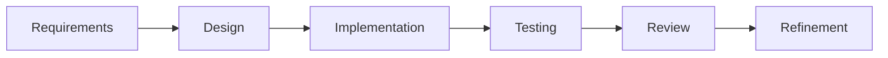

# Chapter 7 – Prompt Engineering for Software Engineers

> *The quality of AI-assisted software development depends less on asking clever questions and more on providing clear context, precise objectives, and measurable outcomes.*

## Learning Objectives

After completing this chapter you will be able to:

- Write prompts that produce reliable engineering results.
- Structure prompts for analysis, design, implementation, and review.
- Reduce ambiguity and improve AI response quality.
- Build reusable prompt templates for software projects.

---

# 7.1 What Is Prompt Engineering?

Prompt engineering is the practice of communicating with AI systems in a structured way to achieve predictable, high-quality results.

For software engineers, a prompt should communicate:

- Business objective
- Technical context
- Constraints
- Expected output
- Validation criteria

The goal is not to "trick" the model but to reduce ambiguity.

---

# 7.2 Anatomy of an Effective Prompt

A professional engineering prompt usually contains:

1. **Role** – Who should the AI act as?
2. **Context** – What project or system is involved?
3. **Task** – What should be accomplished?
4. **Constraints** – What rules must be followed?
5. **Output Format** – How should the response be presented?
6. **Validation** – How should the result be checked?

---

# 7.3 Example

Instead of:

> Generate a login system.

Use:

```text
Act as a senior backend engineer.

Project:
Spring Boot REST API

Task:
Design a secure login endpoint using JWT authentication.

Constraints:
- Follow OWASP recommendations.
- Use layered architecture.
- Explain trade-offs before generating code.
- Generate one component at a time.
- Recommend unit and integration tests.
```

---

# 7.4 Prompt Patterns

| Pattern | Purpose |
|---------|---------|
| Explain | Understand existing systems |
| Compare | Evaluate alternatives |
| Design | Produce architecture proposals |
| Generate | Create code or documentation |
| Review | Identify improvements |
| Refactor | Improve maintainability |
| Test | Generate validation scenarios |

Choose the pattern that matches the engineering task.

---

# 7.5 Iterative Prompting

Professional developers rarely solve a feature with a single prompt.

A better workflow is:



Each prompt builds on the previous result.

---

# Engineering Insight

> Better prompts do not replace engineering knowledge—they amplify it.

---

# Common Mistakes

- Asking for complete applications in one request.
- Omitting project context.
- Failing to specify constraints.
- Accepting the first answer without review.
- Ignoring testing and validation.

---

# Hands-On Lab

Rewrite three prompts from your own projects using the structure introduced in this chapter.

Compare:

- Response quality
- Number of revisions
- Accuracy
- Completeness

Document what improved.

---

# Chapter Summary

Prompt engineering is a communication skill rather than a programming skill. Clear objectives, complete context, explicit constraints, and iterative refinement enable AI systems to produce more accurate and maintainable engineering outcomes.

---

# Review Questions

1. What are the six elements of an effective engineering prompt?
2. Why is context important?
3. When should iterative prompting be preferred?
4. Name four prompt patterns.
5. Why should prompts include validation criteria?

---

# Preview

Chapter 8 explores advanced prompting techniques, including chain-of-thought alternatives, decomposition, structured outputs, and prompt libraries for professional software engineering.
