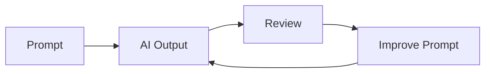

# Chapter 7 -- Prompt Engineering for Software Engineers

> **Goal:** Learn to write effective prompts for day-to-day software
> development.

## Learning Outcomes

After this chapter you can:

-   Write structured prompts
-   Generate better code
-   Refactor safely
-   Generate tests
-   Review AI output critically

------------------------------------------------------------------------

## 1. The Prompt Formula

A good software prompt contains five parts:

``` text
Role
Task
Context
Constraints
Output
```

Example:

``` text
Role: Senior Python Engineer

Task:
Create a REST API for books.

Context:
Python 3.13
FastAPI
PostgreSQL

Constraints:
• Type hints
• PEP 8
• JWT Authentication
• pytest tests

Output:
Project structure followed by source files.
```


------------------------------------------------------------------------

## 2. Prompting Tips

✔ Give project context.

✔ Specify versions.

✔ State coding standards.

✔ Request tests.

✔ Define the expected output.

❌ Avoid prompts like:

``` text
Write login code.
```

Instead:

``` text
Create a secure login API using FastAPI with JWT,
password hashing using bcrypt, structured logging,
pytest tests and OpenAPI documentation.
```

------------------------------------------------------------------------

## 3. Common Development Prompts

### Generate Code

``` text
Implement a FastAPI CRUD service for Products.
Include validation, logging and unit tests.
```

### Refactor

``` text
Refactor without changing behaviour.
Improve readability and remove duplication.
```

### Debug

``` text
Explain this stack trace, identify the root cause,
fix the bug and generate regression tests.
```

### Documentation

``` text
Generate developer documentation in Markdown
including installation and API examples.
```

------------------------------------------------------------------------

## 4. Working Iteratively



Do not expect the first response to be perfect. Iterate until the
solution meets your requirements.

------------------------------------------------------------------------

## 5. Hands-on Lab

Create a prompt that generates a Task Manager REST API.

Requirements:

-   Python 3.13
-   FastAPI
-   SQLite
-   JWT Authentication
-   CRUD Operations
-   Docker
-   pytest

Compare your prompt with the example earlier in this chapter.

------------------------------------------------------------------------

## Commands

``` bash
python -m venv .venv
source .venv/bin/activate
pip install fastapi uvicorn pytest
uvicorn app.main:app --reload
```

------------------------------------------------------------------------

## Screenshot

Capture the following after completing the lab:

-   VS Code Explorer showing the project
-   FastAPI Swagger UI (`http://127.0.0.1:8000/docs`)
-   Terminal running `pytest`

> These screenshots should be created from your own environment so they
> remain current.

------------------------------------------------------------------------

## Best Practices

-   Be specific.
-   Include context.
-   State constraints.
-   Ask for tests.
-   Review all generated code.
-   Never paste secrets into prompts.

------------------------------------------------------------------------

## Summary

Prompt engineering is the skill of writing clear technical instructions
for AI assistants. Treat prompts like software specifications: provide
context, define constraints, and iterate on the results.
