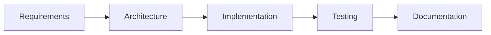

# Chapter 8 – Advanced Prompting Techniques for Professional Software Engineering

> *Professional AI-assisted development is an iterative conversation. Advanced prompting provides the structure needed to solve complex engineering problems reliably.*

## Learning Objectives

- Decompose complex engineering tasks.
- Produce structured AI outputs.
- Build reusable prompt libraries.
- Improve consistency across projects.

## Moving Beyond Basic Prompts

Complex software projects benefit from iterative prompting rather than one-shot requests. Break work into small, verifiable tasks and validate every stage before continuing.

## Decomposition

## Structured Outputs

Request responses with:

1. Assumptions
2. Risks
3. Alternatives
4. Recommended solution
5. Implementation plan
6. Test strategy

## Prompt Libraries

Maintain reusable prompts for:

- Requirements
- Architecture
- Code generation
- Testing
- Documentation
- Code review

Version them alongside your source code.

## Constraint-Driven Prompting

Specify:

- Language
- Framework
- Coding standards
- Security requirements
- Performance expectations
- Output format

## Engineering Insight

> Reusable prompts become valuable engineering assets that improve consistency across teams.

## Common Mistakes

- Missing project constraints
- Mixing unrelated tasks
- Ignoring assumptions
- Failing to iterate
- Not versioning prompt templates

## Hands-On Lab

Create a prompt library for an existing repository and compare results before and after standardising prompts.

## Chapter Summary

Advanced prompting combines decomposition, structured outputs, reusable templates, and explicit constraints to produce more reliable engineering results.

## Review Questions

1. Why decompose engineering tasks?
2. What are structured outputs?
3. Why version prompt libraries?
4. Which constraints improve prompt quality?
5. How do prompt templates improve consistency?

## Preview

Chapter 9 introduces context management and demonstrates how project context influences AI-assisted software development.
