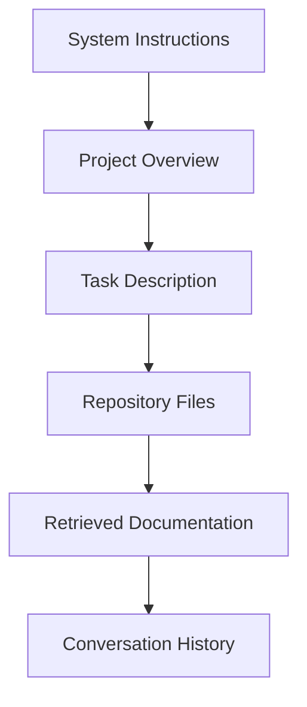

# Chapter 9 – Context Management for AI-Assisted Software Development

> *The most capable AI model cannot produce reliable engineering results if it lacks the right project context.*

## Learning Objectives

After completing this chapter you will be able to:

- Understand the role of context in AI-assisted development.
- Identify the types of context that improve AI responses.
- Build reusable project context documents.
- Manage context across long-running engineering projects.

---

# 9.1 What Is Context?

Context is every piece of information the AI needs to complete a task correctly.

Examples include:

- Business objectives
- Functional requirements
- Architecture
- Coding standards
- Repository structure
- Technology stack
- Previous design decisions
- Test strategy

The more relevant the context, the more reliable the response.

---

# 9.2 Layers of Context

Each layer builds on the previous one.

---

# 9.3 Creating a Project Context File

Maintain a document such as `PROJECT_CONTEXT.md` containing:

- Project purpose
- Architecture summary
- Technology stack
- Coding conventions
- Build instructions
- Testing strategy
- Known limitations
- Active milestones

Store it in version control and update it regularly.

---

# 9.4 Context for Different Tasks

| Engineering Task | Useful Context |
|------------------|----------------|
| Requirements | Business goals, stakeholders |
| Architecture | Existing system design |
| Coding | Interfaces, coding standards |
| Testing | Acceptance criteria, edge cases |
| Documentation | Features and release history |
| Debugging | Logs, stack traces, configuration |

---

# 9.5 Managing Context Size

Avoid overwhelming the model.

Provide:

- Only relevant files.
- Recent architectural decisions.
- Focused documentation.
- Task-specific requirements.

Remove obsolete information to reduce confusion.

---

# Engineering Insight

> High-quality context often improves results more than switching to a larger model.

---

# Common Mistakes

- Assuming the AI already understands the project.
- Providing unrelated files.
- Forgetting to update project summaries.
- Mixing multiple tasks into one conversation.
- Omitting coding standards.

---

# Hands-On Lab

Create a `PROJECT_CONTEXT.md` for an existing repository.

Include:

1. Project overview.
2. Architecture.
3. Build instructions.
4. Coding standards.
5. Current milestone.

Use it with multiple AI tools and compare the quality of the responses.

---

# Chapter Summary

Context management is one of the most valuable skills in AI-assisted software engineering. Well-structured, current, and task-specific context enables AI systems to generate more accurate, maintainable, and consistent solutions.

---

# Review Questions

1. What is project context?
2. Why should context be version-controlled?
3. Which information belongs in a project context file?
4. Why should irrelevant context be removed?
5. How does context improve AI-assisted development?

---

# Preview

Chapter 10 explores conversational workflows and demonstrates how to collaborate effectively with AI across extended engineering sessions.
