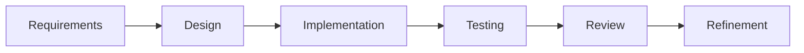

# Chapter 10 – Conversational Workflows for AI-Assisted Software Development

> *AI-assisted software engineering is most effective when treated as an ongoing technical conversation rather than a sequence of unrelated prompts.*

## Learning Objectives

- Build productive multi-step conversations with AI.
- Maintain continuity across engineering sessions.
- Transition from analysis to implementation methodically.
- Decide when to continue or restart a conversation.

## Thinking in Conversations

Software engineering is iterative. Requirements evolve, designs are refined, and implementations are reviewed. AI collaboration should follow the same pattern.

## Engineering Workflow

## Conversation Strategy

1. Define the objective.
2. Share project context.
3. Clarify assumptions.
4. Explore alternatives.
5. Implement incrementally.
6. Validate with tests.
7. Review and refine.

## Maintaining Context

- Summarize completed work.
- Remove outdated information.
- Restate current goals.
- Preserve important design decisions.

## When to Start Fresh

Begin a new conversation for a different project, technology stack, or major architectural change.

## Engineering Insight

> Periodic summaries improve long-running AI conversations by keeping context accurate.

## Common Mistakes

- Mixing unrelated tasks.
- Assuming missing context.
- Skipping architecture discussions.
- Ignoring changing requirements.
- Accepting first responses without refinement.

## Hands-On Lab

Complete one feature through a structured AI conversation and document how the design, implementation, testing, and review evolved.

## Chapter Summary

Conversational workflows improve AI-assisted development by mirroring the iterative nature of professional software engineering.

## Review Questions

1. Why are iterative conversations valuable?
2. When should you summarize context?
3. When should you start a new conversation?
4. Why should architecture precede coding?
5. How does refinement improve outcomes?

## Preview

Chapter 11 introduces AI-assisted requirements engineering.
