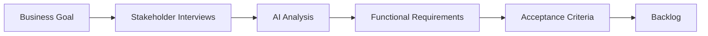

# Chapter 11 – AI-Assisted Requirements Engineering

> *Successful software projects begin with clear requirements. AI helps engineers discover ambiguity, identify gaps, and improve communication—but humans remain responsible for defining what should be built.*

## Learning Objectives

- Explain the role of AI in requirements engineering.
- Transform business goals into structured requirements.
- Identify ambiguity, assumptions, and edge cases.
- Produce user stories and acceptance criteria with AI assistance.

## Why Requirements Matter

Defects introduced during requirements analysis are among the most expensive to correct later in the software lifecycle. AI is particularly effective at reviewing natural language, highlighting inconsistencies, and suggesting missing scenarios.

## Requirements Workflow

## Functional vs Non-Functional Requirements

| Type | Examples |
|------|----------|
| Functional | Login, search, reporting |
| Non-functional | Security, performance, scalability, availability |

Both categories should be captured before implementation begins.

## AI-Assisted Techniques

Use AI to:

- Rewrite ambiguous requirements.
- Identify missing stakeholders.
- Suggest edge cases.
- Generate user stories.
- Draft acceptance criteria.
- Produce a glossary of business terms.

Always validate AI suggestions with domain experts.

## User Stories

A complete user story should include:

- Persona
- Goal
- Business value
- Acceptance criteria
- Dependencies
- Assumptions

## Engineering Insight

> AI improves requirement quality by asking better questions—not by replacing conversations with stakeholders.

## Common Mistakes

- Writing implementation details instead of requirements.
- Ignoring non-functional requirements.
- Missing acceptance criteria.
- Assuming AI understands business rules.
- Skipping stakeholder validation.

## Hands-On Lab

Choose an existing feature and:

1. Rewrite the requirements.
2. Generate user stories.
3. Create acceptance criteria.
4. Identify edge cases.
5. Review the results with a stakeholder or teammate.

## Chapter Summary

AI is a valuable assistant during requirements engineering because it accelerates analysis, improves clarity, and highlights omissions. High-quality software still depends on collaboration between engineers, stakeholders, and domain experts.

## Review Questions

1. Why are requirements critical?
2. What is the difference between functional and non-functional requirements?
3. How can AI improve requirement quality?
4. Why should acceptance criteria be defined early?
5. Why must stakeholders validate AI-assisted requirements?

## Preview

Chapter 12 explores AI-assisted architecture and system design, showing how AI can evaluate design alternatives, identify trade-offs, and support architectural decision-making.
