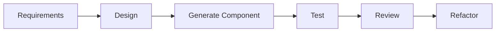

# Chapter 13 – AI-Assisted Code Generation

> *Generating code is the beginning of engineering, not the end.*

## Learning Objectives

- Generate production-quality code incrementally.
- Review and validate AI-generated implementations.
- Apply coding standards and testing before acceptance.

## Principles

Generate one logical component at a time. Prefer interfaces before implementations. Review every generated change using automated tests, static analysis, and peer review.

## Recommended Workflow

1. Generate a small component.
2. Compile and run tests.
3. Review readability.
4. Check security.
5. Refactor if required.
6. Commit.

## Engineering Insight

> Small, reviewable changes consistently outperform large AI-generated commits.

## Common Mistakes

- Generating complete applications.
- Ignoring compiler warnings.
- Skipping tests.
- Accepting duplicated code.

## Hands-On Lab

Implement a CRUD service one endpoint at a time, validating each change before continuing.

## Chapter Summary

AI accelerates implementation, but production-quality software still depends on disciplined review, testing, and refactoring.

## Review Questions

1. Why generate incrementally?
2. Why test every change?
3. When should refactoring occur?

## Preview

Chapter 14 focuses on AI-assisted debugging and troubleshooting.
