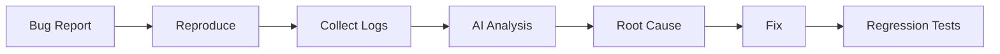

# Chapter 14 – AI-Assisted Debugging and Troubleshooting

> *Debugging is the process of understanding why software behaves differently from expectations. AI accelerates diagnosis, but engineers confirm the root cause.*

## Learning Objectives

- Use AI to investigate defects.
- Analyse stack traces and logs.
- Build repeatable debugging workflows.

## Debugging Workflow

## AI Can Help

- Explain exceptions.
- Summarise logs.
- Suggest hypotheses.
- Identify suspicious code paths.
- Recommend regression tests.

## Engineering Insight

> Fix the cause—not the symptom.

## Common Mistakes

- Asking AI to guess without logs.
- Skipping reproduction.
- Ignoring monitoring data.
- Deploying fixes without regression tests.

## Hands-On Lab

Investigate a failing unit test, document the root cause, implement the fix, and add a regression test.

## Chapter Summary

AI reduces investigation time, while systematic debugging practices ensure reliable fixes.

## Review Questions

1. Why reproduce defects first?
2. Why analyse logs?
3. What is a regression test?

## Preview

Chapter 15 introduces AI-assisted software testing and quality assurance.
