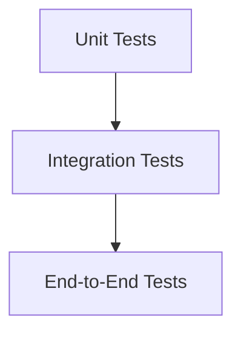

# Chapter 15 – AI-Assisted Testing and Quality Assurance

> *AI can generate tests quickly, but only thoughtful test design produces confidence in software quality.*

## Learning Objectives

- Generate effective automated tests with AI.
- Design balanced testing strategies.
- Review AI-generated test suites.

## Testing Pyramid

## AI-Assisted Testing

Use AI to create:

- Unit tests
- Integration tests
- Boundary tests
- Regression tests
- Test documentation

Review every generated assertion and expected outcome.

## Quality Checklist

- Requirements covered
- Edge cases tested
- Negative scenarios included
- Readable test names
- Independent execution

## Engineering Insight

> Tests are executable specifications of expected behaviour.

## Common Mistakes

- Measuring quality by test count alone.
- Ignoring edge cases.
- Accepting flaky tests.
- Not maintaining tests.

## Hands-On Lab

Expand an existing test suite to improve coverage, then compare manual and AI-generated tests.

## Chapter Summary

AI accelerates testing, but engineers remain responsible for selecting meaningful scenarios and maintaining reliable test suites.

## Review Questions

1. Why are unit tests important?
2. What makes a good regression test?
3. Why review AI-generated tests?

## End of Part 2

The next chapter begins professional AI-assisted development workflows in modern IDEs.
