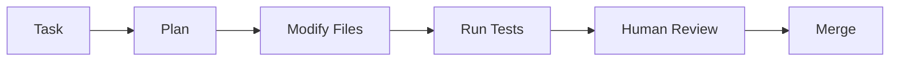

# Chapter 18 – AI-Assisted Development with Codex

> *Agentic coding tools extend AI beyond conversation by planning and applying changes directly within a codebase.*

## Learning Objectives
- Understand agent-assisted development.
- Use Codex-style workflows safely.
- Apply review gates before accepting automated changes.

## Agent Workflow

## Safe Practices

- Review execution plans.
- Limit permissions.
- Require automated tests.
- Validate security-sensitive changes.
- Approve before merging.

## Engineering Insight

> Automation should reduce repetitive work while preserving human accountability.

## Common Mistakes

- Allowing unrestricted repository access.
- Skipping execution plan reviews.
- Merging automated changes without testing.

## Hands-On Lab

Use an agentic coding tool to refactor a small project, inspect every proposed change, execute the test suite, and review the resulting pull request.

## Chapter Summary

Agent-assisted development accelerates engineering tasks, but disciplined review, testing, and approval remain essential for production software.

## Review Questions

1. How do coding agents differ from conversational AI?
2. Why review execution plans?
3. Which changes always require human approval?
