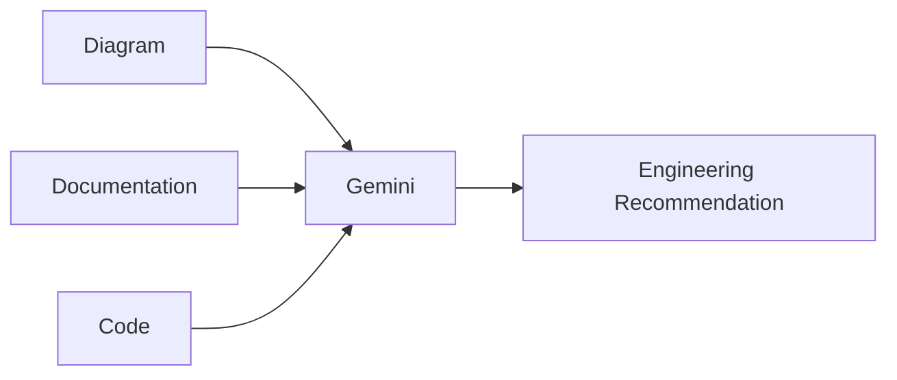

# Chapter 22 – AI-Assisted Development with Gemini

> *Multimodal AI expands software engineering beyond text by combining code, diagrams, screenshots, and documentation.*

## Learning Objectives
- Use multimodal AI effectively.
- Analyse diagrams and UI designs.
- Combine research with engineering decisions.

## Multimodal Workflow

## Best Practices

- Supply diagrams with supporting documentation.
- Verify research using authoritative sources.
- Separate factual findings from assumptions.

## Engineering Insight

> Combining multiple forms of context often produces better engineering decisions than code alone.

## Common Mistakes

- Analysing screenshots without requirements.
- Ignoring version differences.
- Accepting external information without verification.

## Hands-On Lab

Review a UI mock-up and produce implementation guidance with supporting documentation.

## Chapter Summary

Multimodal AI strengthens architecture reviews, UI analysis, documentation, and technical research.
