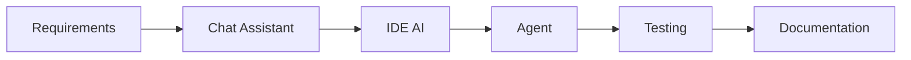

# Chapter 23 – Multi-Tool AI Development Workflows

> *Professional teams achieve the best results by combining specialised AI tools within a disciplined engineering workflow.*

## Learning Objectives
- Select the right AI tool for each task.
- Transfer context between tools.
- Build repeatable multi-tool workflows.

## Workflow

## Tool Selection

| Activity | Typical Tool |
|---|---|
| Requirements | Conversational AI |
| Coding | IDE assistant |
| Repository changes | Coding agent |
| Architecture | Long-context AI |
| Research | Multimodal AI |

## Engineering Insight

> AI tools are complementary. Productivity comes from orchestration rather than relying on a single assistant.

## Common Mistakes

- Using one tool for every task.
- Losing project context when switching tools.
- Skipping validation between stages.

## Hands-On Lab

Complete one feature using multiple AI tools and compare productivity, quality, and review effort.

## Chapter Summary

A structured multi-tool workflow allows engineering teams to combine the strengths of specialised AI systems while preserving software quality.
