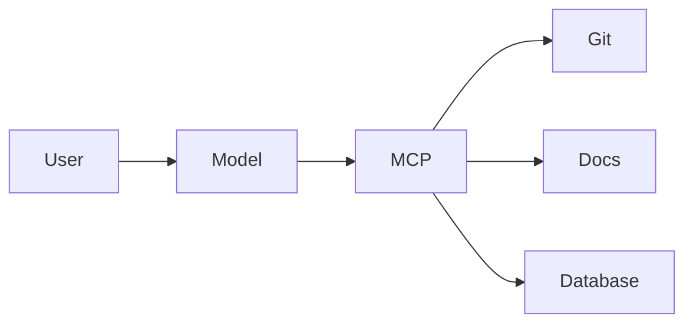

# Chapter 25 – Model Context Protocol (MCP)

> *MCP standardizes how AI models securely interact with external tools and data.*

## Learning Objectives
- Explain MCP concepts.
- Connect AI to tools safely.
- Design secure tool integrations.

## Best Practices
- Least privilege
- Audit tool calls
- Validate outputs

## Engineering Insight
> Standardized tool interfaces simplify AI integration.

## Hands-On Lab
Connect an AI assistant to documentation and source-control tools using an MCP-compatible server.

## Summary
MCP enables secure, reusable integrations between AI systems and engineering tools.
