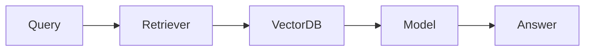

# Chapter 26 – Retrieval-Augmented Generation (RAG)

> *Reliable AI answers begin with reliable knowledge.*

## Learning Objectives
- Understand RAG architecture.
- Build document retrieval pipelines.
- Improve answer quality with external knowledge.

## Key Concepts
- Chunking
- Embeddings
- Retrieval
- Grounded responses

## Engineering Insight
> Retrieval reduces hallucinations by grounding responses in trusted sources.

## Hands-On Lab
Index project documentation and answer engineering questions using retrieved context.

## Summary
RAG combines language models with searchable knowledge to improve accuracy.
