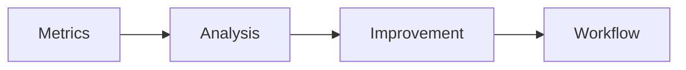

# Chapter 29 – Evaluating AI-Assisted Software Development

> *AI success is measured by engineering outcomes, not generated code.*

## Learning Objectives
- Measure AI effectiveness.
- Define engineering metrics.
- Continuously improve workflows.

## Metrics
- Lead time
- Defect rate
- Review effort
- Test coverage
- Developer satisfaction

## Engineering Insight
> Productivity without quality is not progress.

## Hands-On Lab
Compare a manually implemented feature with an AI-assisted implementation using objective metrics.

## Summary
Continuous measurement enables sustainable AI adoption.
