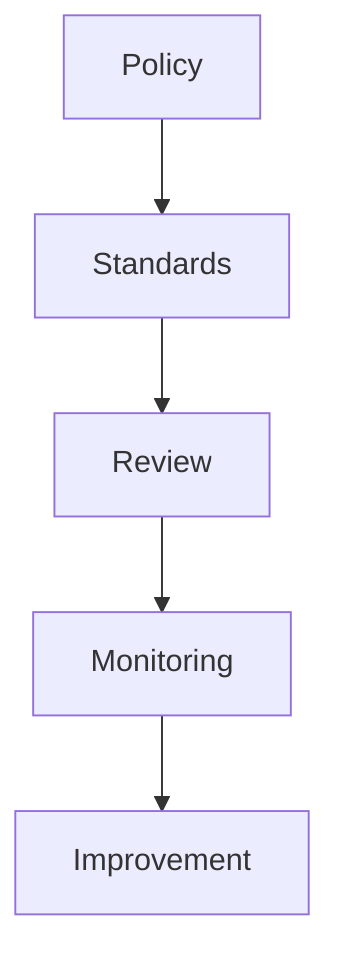

# Chapter 30 – AI Governance, Security, and Responsible Use

> *Responsible AI adoption requires governance, security, transparency, and accountability.*

## Learning Objectives
- Establish AI governance policies.
- Protect confidential information.
- Manage AI-related risks.

## Governance Framework

## Core Principles
- Human accountability
- Privacy
- Security
- Auditability
- Compliance
- Continuous monitoring

## Engineering Insight
> Governance enables innovation by establishing safe operating boundaries.

## Common Mistakes
- Sharing secrets with AI
- Missing approval processes
- Ignoring compliance requirements

## Hands-On Lab
Draft an AI governance policy for a software engineering team covering tool usage, data protection, review processes, and monitoring.

## Summary
Strong governance ensures AI remains a trustworthy engineering capability rather than an unmanaged risk.
