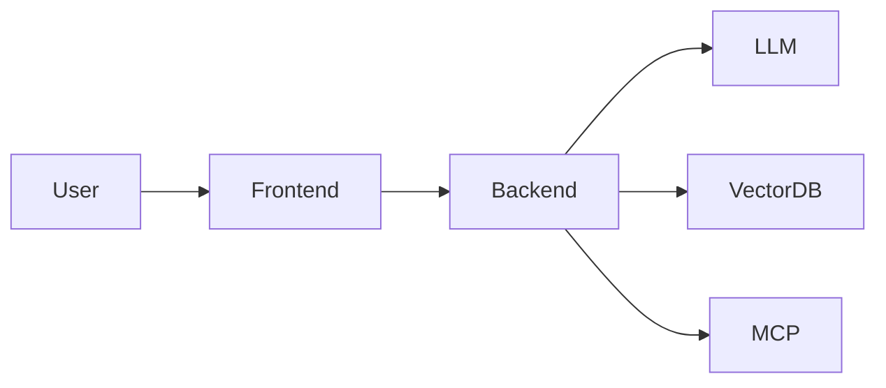

# Chapter 34 – Real-World Project: Building an AI-Native Application

> *AI-native systems treat language models as core architectural components rather than optional features.*

## Learning Objectives

- Build an AI-native application.
- Integrate RAG, MCP, and AI agents.
- Measure AI quality and reliability.

## Features

- Conversational interface
- Repository search
- Documentation assistant
- Tool integration
- Conversation history
- Evaluation metrics

## Engineering Insight

> AI-native architecture requires observability, governance, and continuous evaluation.

## Hands-On Lab

Extend the assistant with authentication, feedback collection, and analytics.

## Chapter Summary

This project demonstrates modern AI-native software architecture.
