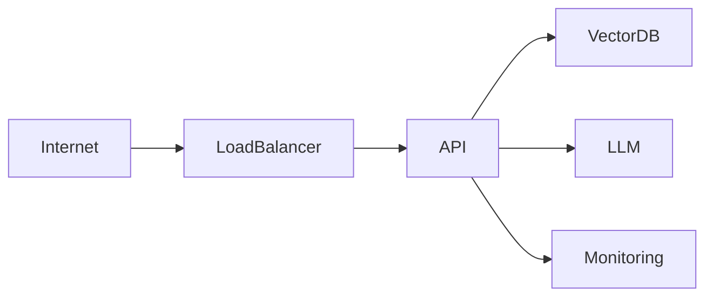

# Chapter 35 – Real-World Project: Deploying AI-Native Applications

> *Reliable AI systems require production engineering as much as intelligent models.*

## Learning Objectives

- Deploy AI-native applications.
- Monitor quality, cost, and performance.
- Build resilient production systems.

## Production Topics

- Containers
- Kubernetes
- Monitoring
- Logging
- Secrets
- Cost management
- Disaster recovery

## Engineering Insight

> Successful AI systems are measured by reliability, security, and maintainability rather than model capability alone.

## Hands-On Lab

Deploy the AI Knowledge Assistant to a container platform, configure dashboards, and perform a production readiness review.

## Chapter Summary

Operating AI-native systems successfully requires combining software engineering discipline with AI-specific operational practices.
