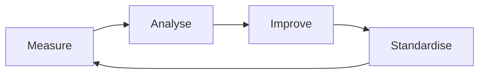

# Chapter 36 – Best Practices, Anti-Patterns, and the Future of AI-Assisted Software Development

> *The tools will evolve. Engineering principles endure. The most successful developers will be those who combine deep technical expertise with the effective use of artificial intelligence.*

## Learning Objectives

After completing this chapter you will be able to:

- Apply proven best practices for AI-assisted software engineering.
- Recognize common anti-patterns before they become expensive problems.
- Evaluate and continuously improve your AI-assisted workflow.
- Build a long-term learning roadmap for AI engineering.
- Understand the emerging trends shaping the future of software development.

---

# Looking Back

Throughout this book you have explored the complete AI-assisted software development lifecycle—from understanding large language models and prompt engineering to building production-ready applications with AI agents, Retrieval-Augmented Generation (RAG), Model Context Protocol (MCP), and modern development environments.

One consistent theme has emerged:

**AI amplifies engineering capability, but it does not replace engineering responsibility.**

The practices described in this final chapter help ensure that AI remains a force multiplier rather than a source of technical debt.

---

# Best Practices

Successful engineering teams consistently:

- Begin with clear business objectives.
- Clarify requirements before implementation.
- Build software incrementally.
- Keep architecture simple and well documented.
- Validate every AI-generated artifact.
- Automate testing, formatting, and static analysis.
- Review code through peer review and continuous integration.
- Protect confidential information.
- Maintain high-quality project context.
- Measure outcomes rather than AI usage.

---

# Common Anti-Patterns

Avoid these recurring mistakes:

| Anti-Pattern | Better Practice |
|--------------|-----------------|
| One-shot application generation | Incremental delivery |
| Blind acceptance of AI output | Review and validation |
| Missing automated tests | Continuous testing |
| Poor documentation | Documentation alongside development |
| Sharing secrets with AI | Secure data handling |
| Tool-first thinking | Requirements-first engineering |
| Chasing the newest model | Improving engineering workflows |

---

# Continuous Improvement

Establish a regular review cycle.

Review:

- Delivery speed
- Defect rates
- Test coverage
- Code review quality
- Documentation completeness
- Developer experience

Small improvements applied consistently have a greater impact than occasional large changes.

---

# Building an AI Engineering Career

Develop expertise in:

1. Software engineering fundamentals.
2. System design and architecture.
3. Cloud-native development.
4. Testing and quality engineering.
5. Security engineering.
6. AI engineering (RAG, MCP, agents, context engineering).
7. Technical communication and mentoring.

The strongest AI engineers combine broad engineering knowledge with continuous learning.

---

# Future Trends

Over the coming years expect continued advances in:

- Agentic software development.
- Multi-agent collaboration.
- Long-context reasoning.
- AI-native development environments.
- Autonomous testing and verification.
- Model evaluation and observability.
- Enterprise AI governance.
- Human-AI collaborative engineering.

While the tools will continue to evolve, the principles of software engineering—clear requirements, thoughtful architecture, testing, security, maintainability, and accountability—will remain constant.

---

# Engineering Insight

> AI changes how software is built, but it does not change what makes software trustworthy.

---

# Common Mistakes

- Measuring productivity only by generated code.
- Ignoring long-term maintainability.
- Replacing engineering judgement with automation.
- Neglecting documentation and knowledge sharing.
- Assuming today's tools will remain unchanged.

---

# Hands-On Lab

Review one of your completed AI-assisted projects.

Evaluate:

1. Requirements quality.
2. Architecture.
3. Testing.
4. Documentation.
5. Security.
6. Maintainability.
7. AI workflow effectiveness.

Create a prioritized improvement backlog and estimate the engineering effort required for each enhancement.

---

# Chapter Summary

Artificial intelligence has become an essential part of modern software engineering. Used responsibly, it enables faster learning, higher productivity, improved documentation, better testing, and more effective collaboration.

The future belongs to engineers who understand both software engineering fundamentals and AI-assisted workflows. By combining critical thinking, disciplined engineering practices, and continuous learning, you can build systems that are not only innovative, but also reliable, secure, and maintainable.

Thank you for reading *AI-Assisted Software Development*. May this book serve as a foundation for your continued growth as an engineer in the age of AI.

---

# Review Questions

1. Which best practices should every AI-assisted development team adopt?
2. Why are incremental workflows safer than one-shot generation?
3. Which engineering metrics best demonstrate successful AI adoption?
4. How can organizations continuously improve AI-assisted workflows?
5. Which skills should software engineers develop to remain effective in an AI-driven industry?

---

# Final Thoughts

Technology will continue to change. Programming languages, frameworks, AI models, and development tools will evolve.

Curiosity, discipline, sound engineering judgement, and a commitment to continuous learning will remain timeless.

Those qualities—not any specific AI tool—will define the next generation of exceptional software engineers.
